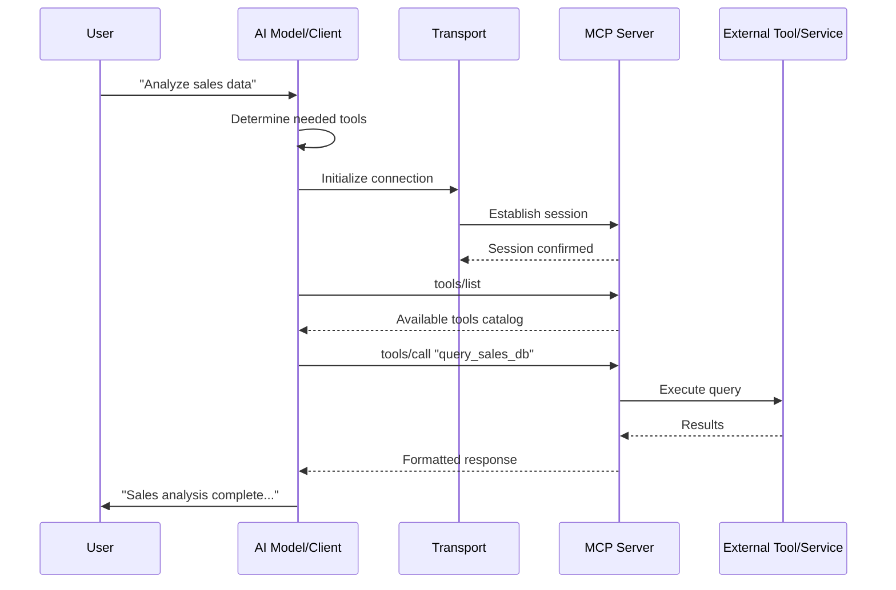
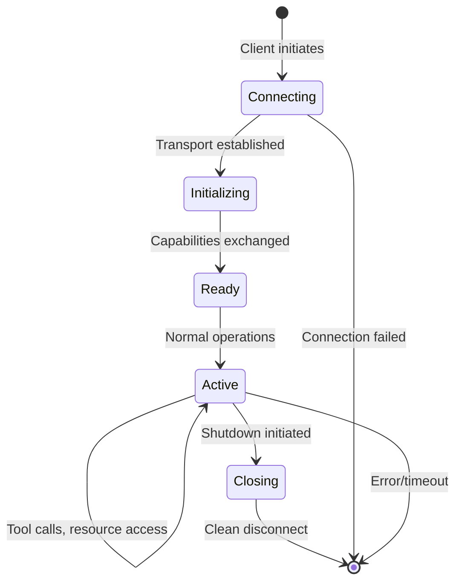

# How MCP Works

## Architecture Overview

MCP follows a client-server architecture where AI models (clients) communicate with tool providers (servers) through a standardized protocol. Let's break down how this works in practice.

## The Complete Flow



## Core Components Deep Dive

### 1. Transport Layer

The transport layer handles the physical communication between clients and servers. MCP supports multiple transport types:

#### **Standard I/O (stdio)**
Perfect for local tools and development:
```python
# Server launches as subprocess
transport = StdioTransport(
    command="mcp-server-filesystem",
    args=["--root", "/data"]
)
```

#### **HTTP/HTTPS**
For network services and APIs:
```python
# Connect over HTTP
transport = HttpTransport(
    url="https://api.example.com/mcp",
    headers={"Authorization": "Bearer token"}
)
```

#### **WebSocket**
For real-time, bidirectional communication:
```python
# Streaming connection
transport = WebSocketTransport(
    url="wss://stream.example.com/mcp"
)
```

### 2. Message Protocol

MCP uses JSON-RPC 2.0 for all communications. Every interaction follows this pattern:

#### **Request Structure**
```json
{
  "jsonrpc": "2.0",
  "id": "unique-request-id",
  "method": "tools/call",
  "params": {
    "name": "calculator",
    "arguments": {
      "operation": "sqrt",
      "number": 16
    }
  }
}
```

#### **Response Structure**
```json
{
  "jsonrpc": "2.0",
  "id": "unique-request-id",
  "result": {
    "content": [
      {
        "type": "text",
        "text": "4"
      }
    ]
  }
}
```

### 3. Session Lifecycle

Every MCP interaction follows a defined lifecycle:



### 4. Capability Negotiation

When a connection is established, client and server exchange capabilities:

```json
// Client announces what it supports
{
  "method": "initialize",
  "params": {
    "protocolVersion": "1.0",
    "capabilities": {
      "tools": true,
      "resources": true,
      "prompts": true,
      "streaming": true
    }
  }
}

// Server responds with its capabilities
{
  "result": {
    "protocolVersion": "1.0",
    "capabilities": {
      "tools": {
        "listChanged": true
      },
      "resources": {
        "subscribe": true,
        "listChanged": true
      }
    }
  }
}
```

## The Three Pillars of MCP

### 🔧 **Tools**
Functions that AI can execute:

```python
# Server defines a tool
@server.tool()
async def calculate_metric(
    metric: str,
    start_date: str,
    end_date: str
) -> ToolResult:
    # Implementation
    result = await db.query(...)
    return ToolResult(content=[
        TextContent(text=f"Result: {result}")
    ])
```

### 📁 **Resources**
Data sources AI can access:

```python
# Server exposes resources
@server.list_resources()
async def list_resources() -> list[Resource]:
    return [
        Resource(
            uri="file:///reports/2024/sales.csv",
            name="2024 Sales Report",
            mimeType="text/csv"
        )
    ]
```

### 💬 **Prompts**
Templated interactions:

```python
# Server provides prompts
@server.list_prompts()
async def list_prompts() -> list[Prompt]:
    return [
        Prompt(
            name="analyze_performance",
            description="Analyze system performance",
            arguments=[
                PromptArgument(
                    name="timeframe",
                    description="Time period to analyze",
                    required=True
                )
            ]
        )
    ]
```

## Real-World Example: Database Query

Let's trace a complete database query through MCP:

### Step 1: Client Requests Available Tools
```json
{
  "method": "tools/list",
  "id": "1"
}
```

### Step 2: Server Returns Tool Catalog
```json
{
  "result": {
    "tools": [{
      "name": "sql_query",
      "description": "Execute read-only SQL queries",
      "inputSchema": {
        "type": "object",
        "properties": {
          "query": {
            "type": "string",
            "description": "SQL query to execute"
          },
          "database": {
            "type": "string",
            "enum": ["sales", "inventory", "customers"]
          }
        },
        "required": ["query", "database"]
      }
    }]
  }
}
```

### Step 3: Client Executes Tool
```json
{
  "method": "tools/call",
  "params": {
    "name": "sql_query",
    "arguments": {
      "database": "sales",
      "query": "SELECT SUM(revenue) FROM orders WHERE date >= '2024-01-01'"
    }
  }
}
```

### Step 4: Server Returns Results
```json
{
  "result": {
    "content": [{
      "type": "text",
      "text": "Total revenue for 2024: $1,234,567.89"
    }],
    "isError": false
  }
}
```

## Error Handling

MCP provides standardized error handling:

```json
{
  "error": {
    "code": -32602,
    "message": "Invalid params",
    "data": {
      "details": "Database 'production' not in allowed list"
    }
  }
}
```

Common error codes:
- `-32700`: Parse error
- `-32600`: Invalid request
- `-32601`: Method not found
- `-32602`: Invalid params
- `-32603`: Internal error

## Performance Considerations

### Batching Requests
MCP supports request batching for efficiency:
```json
[
  {"method": "tools/call", "params": {...}, "id": "1"},
  {"method": "tools/call", "params": {...}, "id": "2"},
  {"method": "resources/read", "params": {...}, "id": "3"}
]
```

### Streaming Responses
For large data sets or real-time updates:
```python
async for chunk in client.stream_resource("logs/live"):
    process_log_entry(chunk)
```

## Security Model

MCP implements defense in depth:

1. **Transport Security**: TLS/mTLS for network transports
2. **Authentication**: Multiple methods supported
3. **Authorization**: Fine-grained permissions
4. **Rate Limiting**: Built-in DoS protection
5. **Input Validation**: Automatic schema validation

## Best Practices

1. **Always validate inputs** - Use JSON Schema
2. **Handle errors gracefully** - Provide helpful error messages
3. **Implement timeouts** - Prevent hanging connections
4. **Log appropriately** - Aid debugging without exposing secrets
5. **Version your servers** - Support protocol evolution

## Summary

MCP works by:
- ✅ Establishing secure client-server connections
- ✅ Negotiating capabilities between parties
- ✅ Exposing tools, resources, and prompts
- ✅ Using JSON-RPC 2.0 for all communication
- ✅ Providing standardized error handling
- ✅ Supporting multiple transport options

Ready to see these concepts in action? Head to our [Quick Start Guide →](/samples/hello-mcp/)

<script type="application/ld+json">
{
  "@context": "https://schema.org",
  "@type": "TechArticle",
  "headline": "How MCP Works - Architecture and Implementation",
  "description": "Deep dive into the Model Context Protocol architecture, message flow, and core components",
  "author": {
    "@type": "Organization",
    "name": "How MCP Works"
  }
}
</script>