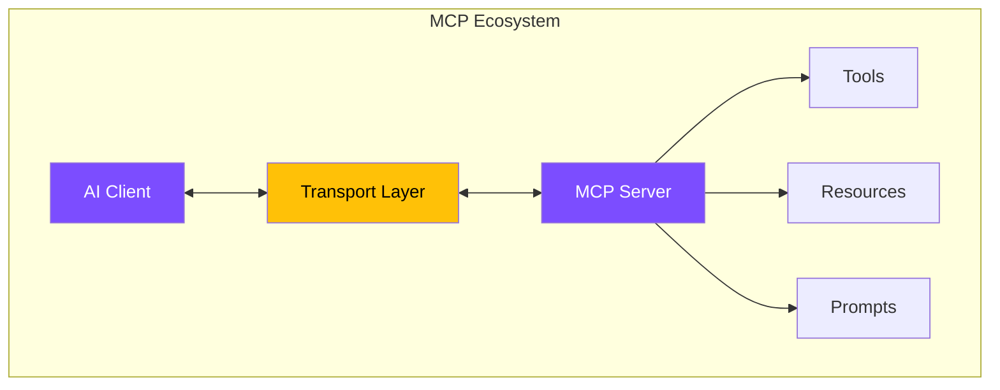

# Core Concepts

Understanding MCP starts with grasping its fundamental building blocks. This section breaks down the protocol into digestible concepts that will give you a solid foundation for implementation.

## Start Your Learning Journey

  
  

    <h3>🤔 What is MCP?</h3>
    
Discover the Model Context Protocol - a standardized way for AI models to interact with external systems.

    <a href="/concepts/what-is-mcp/" class="md-button md-button--primary">Learn What →</a>
  

  
  

    <h3>💡 Why It Matters</h3>
    
Understand the problems MCP solves and why it's becoming the standard for AI integrations.

    <a href="/concepts/why-it-matters/" class="md-button md-button--primary">Discover Why →</a>
  

  
  

    <h3>⚙️ How It Works</h3>
    
Explore the architecture, message flow, and core components that power MCP.

    <a href="/concepts/how-it-works/" class="md-button md-button--primary">See How →</a>
  

  

## Quick Reference

  
  <a href="/concepts/glossary/" style="display: block; padding: 1rem; text-align: center; background: var(--md-code-bg-color); border-radius: 8px; text-decoration: none; color: inherit;">
    <strong>📖 Glossary</strong> 
    <small>Key terms and definitions</small>
  </a>
  
  <a href="/concepts/faq/" style="display: block; padding: 1rem; text-align: center; background: var(--md-code-bg-color); border-radius: 8px; text-decoration: none; color: inherit;">
    <strong>❓ FAQ</strong> 
    <small>Common questions answered</small>
  </a>
  

## Core Components at a Glance

## Learning Path

Whether you're a developer, architect, or product manager, we've structured these concepts to build on each other:

1. **Start with "What is MCP?"** - Get the big picture
2. **Move to "Why It Matters"** - Understand the value proposition  
3. **Deep dive into "How It Works"** - Master the technical details
4. **Reference the Glossary** - Clarify any terms
5. **Check the FAQ** - Find quick answers

!!! tip "Pro Tip"
    After understanding these concepts, head to our [Quick Start Guide](/samples/hello-mcp/) to see MCP in action with real code examples.

## What You'll Learn

By the end of this section, you'll understand:

- ✅ The problem MCP solves in the AI ecosystem
- ✅ How MCP differs from traditional API approaches
- ✅ The client-server architecture and message flow
- ✅ Key terminology used throughout the documentation
- ✅ Answers to common questions and concerns

Ready to begin? Let's start with understanding [What is MCP?](/concepts/what-is-mcp/)