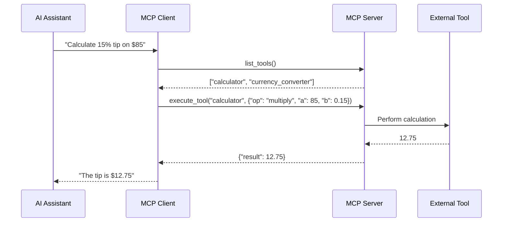

# What is MCP?

## The Model Context Protocol Explained

The **Model Context Protocol (MCP)** is an open standard that enables seamless communication between AI models and external tools, data sources, and services. Think of it as a universal adapter that allows AI assistants to interact with any system in a standardized way.

## Definition in Plain English

> **MCP is a protocol that lets AI models use tools and access data through a consistent interface, regardless of the underlying implementation.**

Just like HTTP standardized web communication, MCP standardizes AI-to-tool communication. Any AI model that speaks MCP can interact with any tool that implements MCP, creating a truly interoperable ecosystem.

## The Analogy That Clicks

Imagine you're traveling internationally with your devices:

- **Without MCP**: You need different adapters for each country (custom integrations for each AI platform)
- **With MCP**: You have one universal adapter that works everywhere (one protocol for all integrations)

## Core Components

### 1. **Clients** 
The AI applications that want to use external tools and data. Examples:
- AI assistants like Claude
- Custom AI agents
- Development tools with AI features

### 2. **Servers**
Services that expose tools and data to AI clients. Examples:
- Database connectors
- File system interfaces
- API gateways
- Calculation engines

### 3. **Transport**
The communication channel between clients and servers:
- Standard I/O (stdio) for local connections
- HTTP/WebSocket for network connections
- Custom transports for specialized needs

## What Makes MCP Special?

### 🎯 **Purpose-Built for AI**
Unlike general APIs, MCP understands AI-specific needs:
- Tool discovery and description
- Parameter validation
- Context management
- Streaming responses

### 🔧 **Standardized Operations**
Every MCP server supports the same core operations:
```python
# Discover available tools
tools = await client.list_tools()

# Get tool descriptions
schema = await client.get_tool_schema("calculator")

# Execute tools with parameters
result = await client.execute_tool("calculator", {
    "operation": "multiply",
    "a": 7,
    "b": 6
})
```

### 🌐 **Language Agnostic**
MCP uses JSON-RPC 2.0 over standard transports, making it accessible from any programming language.

## A Simple Example

Here's MCP in action:



## MCP vs Traditional Approaches

| Aspect | Traditional APIs | MCP |
|--------|-----------------|-----|
| **Integration Effort** | Custom code for each AI platform | Write once, works everywhere |
| **Tool Discovery** | Manual documentation reading | Automatic discovery |
| **Parameter Validation** | Client-side implementation | Built into the protocol |
| **Error Handling** | Varies by implementation | Standardized error codes |
| **Streaming Support** | Custom WebSocket logic | Native protocol support |

## Real-World Applications

MCP enables scenarios like:

- **AI Code Assistants** accessing your local development environment
- **Customer Service Bots** querying multiple backend systems
- **Data Analysis AIs** connecting to various databases and data lakes
- **Automation Agents** controlling IoT devices and services

## The Technical Foundation

MCP builds on established standards:

- **JSON-RPC 2.0** for message format
- **JSON Schema** for parameter validation  
- **OpenRPC** for service description
- **Standard transports** (stdio, HTTP, WebSocket)

This foundation ensures MCP is both powerful and familiar to developers.

## Getting Started is Simple

```bash
# Install an MCP server
npm install -g @mcp/server-filesystem

# Run it
mcp-server-filesystem --path /your/data

# Connect from Python
from mcp import Client
client = Client("filesystem-server")
files = await client.list_resources()
```

## Key Takeaways

- ✅ MCP standardizes how AI models interact with external tools
- ✅ It's language-agnostic and transport-flexible
- ✅ Built on proven standards like JSON-RPC 2.0
- ✅ Enables write-once, integrate-everywhere solutions
- ✅ Designed specifically for AI use cases

Ready to understand why this matters? Continue to [Why MCP Matters →](/concepts/why-it-matters/)

<script type="application/ld+json">
{
  "@context": "https://schema.org",
  "@type": "TechArticle",
  "headline": "What is MCP? - Model Context Protocol Explained",
  "description": "Learn what the Model Context Protocol (MCP) is and how it standardizes AI-to-tool communication",
  "author": {
    "@type": "Organization",
    "name": "How MCP Works"
  },
  "datePublished": "2024-01-01",
  "dateModified": "2024-01-01"
}
</script>