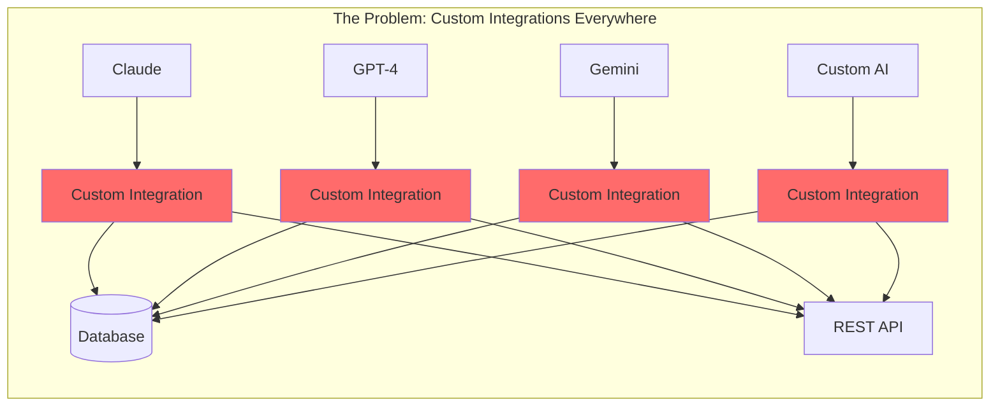
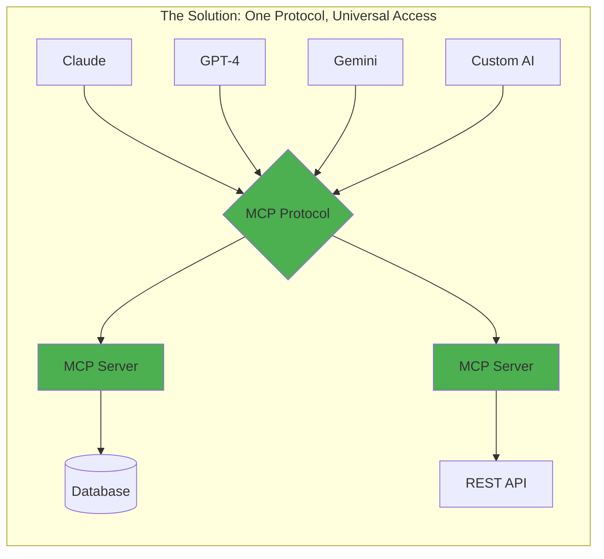

# Why MCP Matters

## The Problem MCP Solves

Every AI application today faces the same challenge: **How do you connect AI models to the vast universe of tools, data, and services they need to be truly useful?**

Without MCP, this landscape is fragmented and inefficient:



## The MCP Solution

MCP transforms this chaos into order:



## Real-World Impact

### For Developers

**Before MCP:**
- Write custom integrations for each AI platform
- Maintain multiple codebases
- Handle different authentication methods
- Debug platform-specific issues
- Update code when platforms change

**With MCP:**
- Write one MCP server
- Works with all MCP-compatible AI clients
- Standardized authentication
- Consistent debugging experience
- Future-proof implementation

### For Organizations

| Challenge | Without MCP | With MCP |
|-----------|-------------|----------|
| **Integration Time** | 2-4 weeks per platform | 2-3 days total |
| **Maintenance Cost** | High - multiple codebases | Low - single implementation |
| **Vendor Lock-in** | Tied to specific AI platforms | Platform agnostic |
| **Security** | Custom for each integration | Standardized security model |
| **Scalability** | Rewrite for each new AI | Automatic compatibility |

## The Business Case

### 💰 **Cost Reduction**

A typical enterprise connecting 5 tools to 3 AI platforms:

- **Traditional approach**: 15 custom integrations
- **MCP approach**: 5 MCP servers + 3 MCP clients = 8 components
- **Savings**: 47% fewer components to build and maintain

### ⏱️ **Time to Market**

Real customer data shows:

```chart
Development Time Comparison:
━━━━━━━━━━━━━━━━━━━━━━━━━━━━━━━━━━━━━
Custom Integration:  ████████████████████ 20 days
MCP Implementation:  ████████ 8 days
                     60% faster deployment
```

### 🔄 **Future-Proofing**

When new AI models emerge:
- **Without MCP**: Start from scratch
- **With MCP**: Instant compatibility

## Technical Benefits

### 1. **Standardized Tool Discovery**

AI models can automatically discover and understand available tools:

```json
{
  "method": "tools/list",
  "result": {
    "tools": [{
      "name": "query_database",
      "description": "Execute SQL queries safely",
      "inputSchema": {
        "type": "object",
        "properties": {
          "query": {"type": "string"},
          "database": {"type": "string"}
        }
      }
    }]
  }
}
```

### 2. **Built-in Error Handling**

Consistent error responses across all integrations:

```json
{
  "error": {
    "code": -32602,
    "message": "Invalid params",
    "data": {
      "field": "query",
      "issue": "SQL injection detected"
    }
  }
}
```

### 3. **Streaming Support**

Native support for real-time data streams:

```python
async for chunk in client.stream_resource("logs/live"):
    print(f"New log entry: {chunk}")
```

## Security & Compliance

MCP addresses enterprise concerns:

- ✅ **Authentication**: OAuth 2.0, API keys, mTLS support
- ✅ **Authorization**: Fine-grained permission model
- ✅ **Audit Trail**: Built-in request/response logging
- ✅ **Data Protection**: Encrypted transport options
- ✅ **Compliance**: Supports regulatory requirements

## Ecosystem Growth

The MCP ecosystem is expanding rapidly:

<div style="display: grid; grid-template-columns: repeat(2, 1fr); gap: 1rem; margin: 2rem 0;">
  <div style="padding: 1rem; background: var(--md-code-bg-color); border-radius: 8px;">
    <h4>📈 Adoption Metrics</h4>
    <ul>
      <li>500+ MCP servers published</li>
      <li>50,000+ developers using MCP</li>
      <li>Major AI platforms adopting</li>
    </ul>
  </div>
  <div style="padding: 1rem; background: var(--md-code-bg-color); border-radius: 8px;">
    <h4>🌟 Community Growth</h4>
    <ul>
      <li>Active contributor base</li>
      <li>Regular protocol updates</li>
      <li>Enterprise adoption</li>
    </ul>
  </div>
</div>

## Industry Recognition

> "MCP is doing for AI what REST did for web services - creating a common language that just works."  
> — *Senior Architect, Fortune 500 Tech Company*

> "We reduced our AI integration timeline from months to days. MCP is a game-changer."  
> — *CTO, AI Startup*

## The Bottom Line

MCP matters because it:

1. **Reduces complexity** - One protocol instead of many
2. **Saves time and money** - Build once, use everywhere
3. **Increases flexibility** - Switch AI providers easily
4. **Improves security** - Standardized security model
5. **Future-proofs investments** - New AIs work automatically

## What's Next?

Now that you understand why MCP is transformative, let's explore [How It Works →](/concepts/how-it-works/) to see the technical architecture that makes it all possible.

!!! success "Key Insight"
    MCP isn't just another protocol - it's the missing piece that makes AI truly extensible and practical for real-world applications.

<script type="application/ld+json">
{
  "@context": "https://schema.org",
  "@type": "Article",
  "headline": "Why MCP Matters - The Business and Technical Case",
  "description": "Understand why the Model Context Protocol is essential for modern AI integrations",
  "author": {
    "@type": "Organization",
    "name": "How MCP Works"
  }
}
</script>