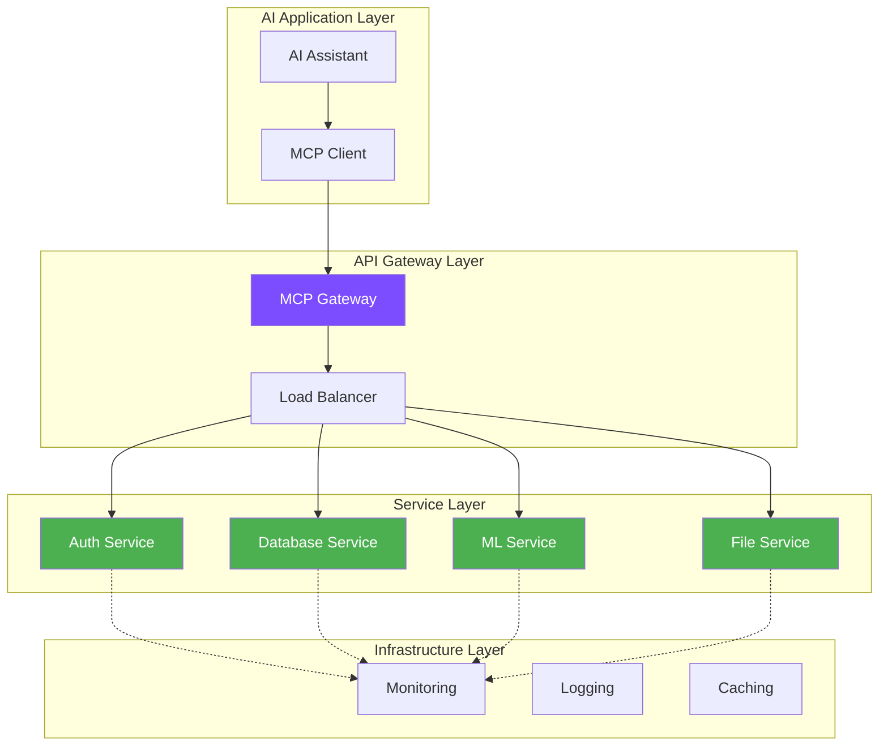
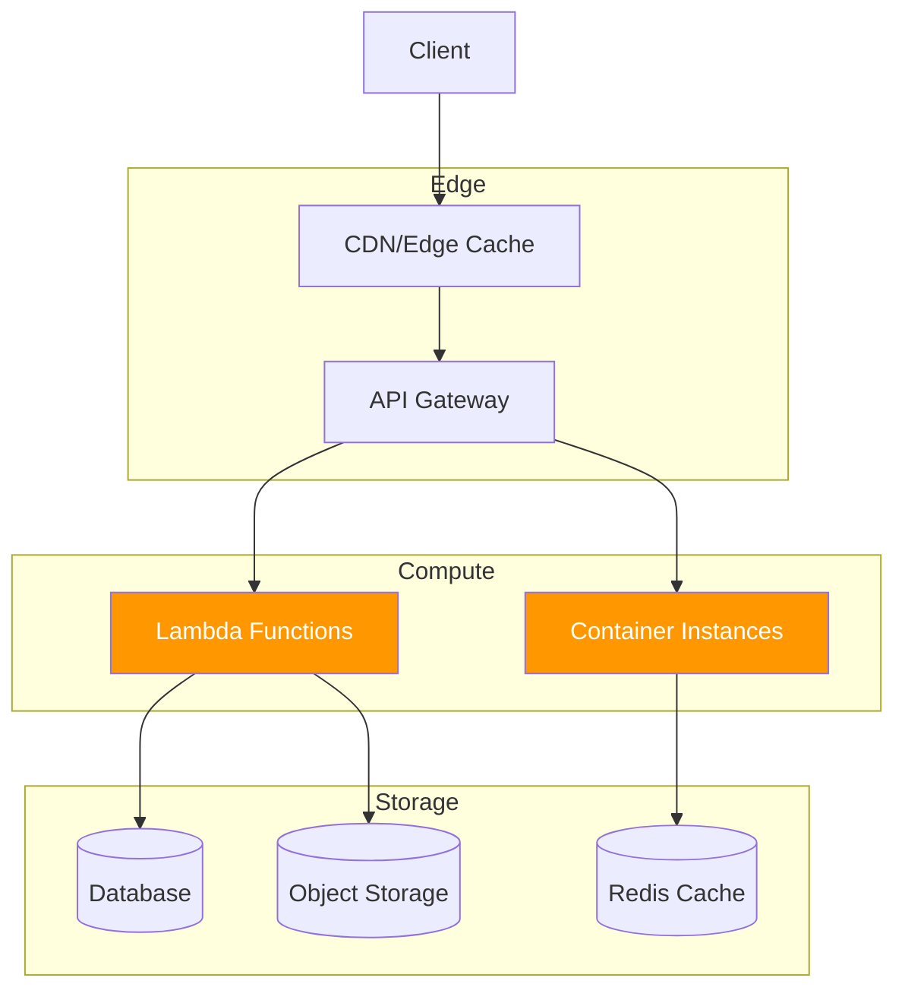
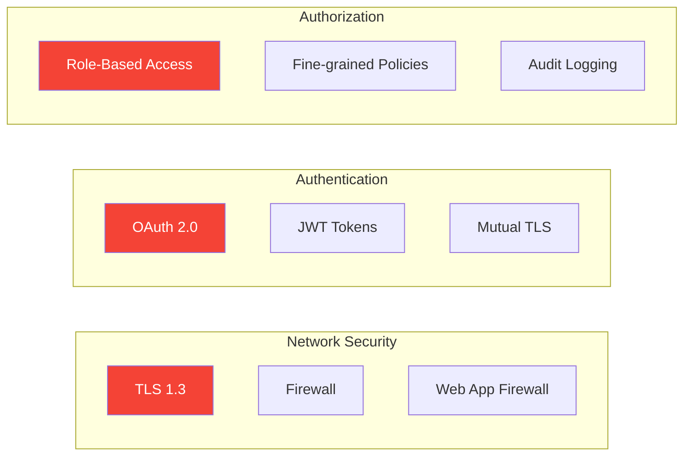

# Implementation Guide

Production-ready guides for building, deploying, and maintaining MCP servers and clients at scale.

## Implementation Roadmap

<div class="roadmap" style="display: grid; grid-template-columns: repeat(auto-fit, minmax(300px, 1fr)); gap: 1.5rem; margin: 2rem 0;">
  
  <div class="roadmap-step" style="padding: 1.5rem; background: var(--md-code-bg-color); border-radius: 8px; border-left: 4px solid var(--md-primary-fg-color);">
    <h3>🏗️ Building Servers</h3>
    <p>Create robust MCP servers that handle real-world workloads with proper error handling and validation.</p>
    <a href="/impl/servers/" class="md-button">Build Servers →</a>
  </div>
  
  <div class="roadmap-step" style="padding: 1.5rem; background: var(--md-code-bg-color); border-radius: 8px; border-left: 4px solid var(--md-accent-fg-color);">
    <h3>📱 Building Clients</h3>
    <p>Develop intelligent clients that efficiently consume MCP services and handle network conditions.</p>
    <a href="/impl/clients/" class="md-button">Build Clients →</a>
  </div>
  
  <div class="roadmap-step" style="padding: 1.5rem; background: var(--md-code-bg-color); border-radius: 8px; border-left: 4px solid var(--md-primary-fg-color);">
    <h3>🚀 Deployment</h3>
    <p>Deploy MCP services across cloud platforms, containers, and edge environments.</p>
    <a href="/impl/deployment/" class="md-button">Deploy →</a>
  </div>
  
  <div class="roadmap-step" style="padding: 1.5rem; background: var(--md-code-bg-color); border-radius: 8px; border-left: 4px solid var(--md-accent-fg-color);">
    <h3>🔒 Security</h3>
    <p>Implement comprehensive security measures including authentication, authorization, and threat protection.</p>
    <a href="/impl/security-hardening/" class="md-button">Secure →</a>
  </div>
  
  <div class="roadmap-step" style="padding: 1.5rem; background: var(--md-code-bg-color); border-radius: 8px; border-left: 4px solid var(--md-primary-fg-color);">
    <h3>📊 Observability</h3>
    <p>Monitor, trace, and debug MCP services with comprehensive observability solutions.</p>
    <a href="/impl/observability/" class="md-button">Monitor →</a>
  </div>
  
  <div class="roadmap-step" style="padding: 1.5rem; background: var(--md-code-bg-color); border-radius: 8px; border-left: 4px solid var(--md-accent-fg-color);">
    <h3>⚡ Performance</h3>
    <p>Optimize MCP implementations for high throughput, low latency, and efficient resource usage.</p>
    <a href="/impl/performance-tuning/" class="md-button">Optimize →</a>
  </div>
  
</div>

## Quick Reference

### Server Implementation Checklist

- [ ] **Protocol Compliance** - JSON-RPC 2.0, proper lifecycle
- [ ] **Tool Definition** - Clear schemas, validation
- [ ] **Error Handling** - Graceful failures, helpful messages
- [ ] **Authentication** - Secure credential handling
- [ ] **Rate Limiting** - DoS protection
- [ ] **Logging** - Structured, searchable logs
- [ ] **Health Checks** - Monitoring endpoints
- [ ] **Documentation** - API docs, examples

### Client Implementation Checklist

- [ ] **Connection Management** - Retry logic, timeouts
- [ ] **Capability Detection** - Graceful degradation
- [ ] **Error Recovery** - Automatic retries, fallbacks
- [ ] **Caching** - Tool metadata, frequent responses
- [ ] **Async Handling** - Non-blocking operations
- [ ] **State Management** - Session persistence
- [ ] **Testing** - Unit, integration, e2e tests
- [ ] **Performance** - Connection pooling, batching

## Architecture Patterns

### Microservices with MCP



### Serverless MCP



## Production Considerations

### Scalability Factors

| Component | Scaling Strategy | Key Metrics |
|-----------|------------------|-------------|
| **MCP Servers** | Horizontal with load balancing | Request rate, response time |
| **Transport Layer** | Connection pooling, multiplexing | Concurrent connections |
| **Tool Execution** | Async processing, queuing | Tool execution time |
| **Data Access** | Caching, read replicas | Query performance |

### Reliability Requirements

1. **Availability** - 99.9%+ uptime with graceful degradation
2. **Durability** - Persistent state management
3. **Consistency** - ACID compliance where needed
4. **Partition Tolerance** - Network failure handling

### Security Domains



## Development Workflow

### Local Development Setup

```bash
# 1. Environment setup
python -m venv mcp-env
source mcp-env/bin/activate
pip install mcp-sdk

# 2. Development server
mcp-dev-server --hot-reload --debug

# 3. Testing
pytest tests/ --cov=src/
mcp-test-client --server=localhost:8080

# 4. Local integration
docker-compose up -d
```

### CI/CD Pipeline

```yaml
# .github/workflows/mcp-deploy.yml
name: MCP Server Deploy
on: [push, pull_request]

jobs:
  test:
    runs-on: ubuntu-latest
    steps:
      - uses: actions/checkout@v4
      - name: Run MCP conformance tests
        run: mcp-test-suite --strict
      
  deploy:
    needs: test
    if: github.ref == 'refs/heads/main'
    runs-on: ubuntu-latest
    steps:
      - name: Deploy to production
        run: |
          mcp-deploy --environment=prod
          mcp-health-check --wait=300
```

## Best Practices Summary

### Server Development
- ✅ Use type hints and validation schemas
- ✅ Implement graceful shutdown handling
- ✅ Add comprehensive error handling
- ✅ Use structured logging with correlation IDs
- ✅ Implement health and readiness probes
- ✅ Follow semantic versioning

### Client Development
- ✅ Implement exponential backoff for retries
- ✅ Use connection pooling for performance
- ✅ Cache tool metadata and schemas
- ✅ Handle partial failures gracefully
- ✅ Implement circuit breaker patterns
- ✅ Add request/response tracing

### Operations
- ✅ Monitor key performance indicators
- ✅ Set up alerting for critical failures
- ✅ Implement blue-green deployments
- ✅ Regular security vulnerability scanning
- ✅ Backup and disaster recovery plans
- ✅ Capacity planning and auto-scaling

Ready to start implementing? Choose your path:

<div style="display: grid; grid-template-columns: repeat(auto-fit, minmax(200px, 1fr)); gap: 1rem; margin: 2rem 0;">
  <a href="/impl/servers/" class="impl-path" style="display: block; padding: 1rem; text-align: center; background: var(--md-primary-fg-color); color: white; border-radius: 8px; text-decoration: none;">
    🏗️ Build Server
  </a>
  <a href="/impl/clients/" class="impl-path" style="display: block; padding: 1rem; text-align: center; background: var(--md-accent-fg-color); color: black; border-radius: 8px; text-decoration: none;">
    📱 Build Client
  </a>
  <a href="/impl/deployment/" class="impl-path" style="display: block; padding: 1rem; text-align: center; background: var(--md-primary-fg-color); color: white; border-radius: 8px; text-decoration: none;">
    🚀 Deploy Service
  </a>
</div>

<script type="application/ld+json">
{
  "@context": "https://schema.org",
  "@type": "TechArticle",
  "headline": "MCP Implementation Guide - Production Ready Development",
  "description": "Comprehensive guide for implementing, deploying, and maintaining Model Context Protocol servers and clients in production environments",
  "keywords": "MCP implementation, model context protocol development, AI integration, production deployment, microservices architecture",
  "author": {
    "@type": "Organization",
    "name": "How MCP Works"
  },
  "datePublished": "2024-06-24",
  "dateModified": "2024-06-24"
}
</script>