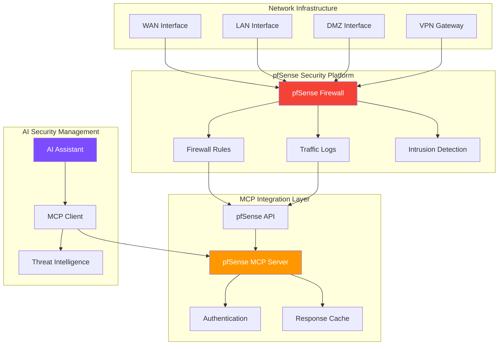

# Network Security with pfSense MCP Server

Learn how to build AI-powered network security management using the pfSense MCP Server for intelligent firewall operations and threat mitigation.

## What You'll Build

An intelligent network security system that enables AI assistants to:
- Manage pfSense firewall rules dynamically
- Monitor network traffic and detect anomalies
- Automate threat response and blocking
- Generate network security reports and insights

## Prerequisites

- pfSense firewall (version 2.6+)
- Python 3.8+ with MCP SDK
- Basic knowledge of network security
- Understanding of firewall concepts and pfSense

## Architecture Overview



## Installation & Setup

### 1. Clone the pfSense MCP Server

```bash
# Clone the repository
git clone https://github.com/gensecaihq/pfsense-mcp-server.git
cd pfsense-mcp-server

# Create virtual environment
python -m venv venv
source venv/bin/activate  # On Windows: venv\Scripts\activate

# Install dependencies
pip install -r requirements.txt
```

### 2. Configure pfSense API Access

First, enable the REST API on your pfSense firewall:

1. Navigate to **System → Package Manager**
2. Install the **pfSense-pkg-API** package
3. Go to **System → API**
4. Enable the API and create API credentials

### 3. Configure MCP Server

Create a configuration file `pfsense_config.yaml`:

```yaml
pfsense:
  host: "192.168.1.1"
  port: 443
  protocol: "https"
  username: "admin"
  password: "your-secure-password"
  api_key: "your-api-key"
  verify_ssl: true
  
mcp:
  server_name: "pfsense-network-security"
  version: "1.0.0"
  
security:
  rate_limit: 50   # requests per minute
  timeout: 30      # seconds
  allowed_operations:
    - "read_rules"
    - "create_rule"
    - "modify_rule"
    - "delete_rule"
    - "read_logs"
    - "block_ip"
  
  restricted_interfaces:
    - "wan"  # Require additional auth for WAN changes
  
logging:
  level: "INFO"
  file: "/var/log/pfsense-mcp.log"
  audit_file: "/var/log/pfsense-mcp-audit.log"

interfaces:
  wan: "em0"
  lan: "em1" 
  dmz: "em2"
```

### 4. Set Up Secure Authentication

Create a dedicated user for MCP operations:

```xml
<!-- Add to pfSense user configuration -->
<user>
    <name>mcp-api-user</name>
    <fullname>MCP API Integration User</fullname>
    <scope>user</scope>
    <groupname>admins</groupname>
    <password>$2y$10$secure-hashed-password</password>
    <uid>2001</uid>
    <priv>page-all</priv>
</user>
```

## Available Tools

The pfSense MCP Server provides comprehensive network security management tools:

### 1. Firewall Rule Management

```python
# List current firewall rules
rules = await client.call_tool("get_firewall_rules", {
    "interface": "wan",
    "enabled_only": true
})

# Create new blocking rule
new_rule = await client.call_tool("create_firewall_rule", {
    "interface": "wan",
    "action": "block",
    "protocol": "tcp",
    "source": "192.168.100.0/24",
    "destination": "any",
    "destination_port": "22",
    "description": "Block SSH from suspicious subnet"
})

# Modify existing rule
modified_rule = await client.call_tool("modify_firewall_rule", {
    "rule_id": "rule_123",
    "enabled": false,
    "description": "Temporarily disabled for maintenance"
})
```

### 2. Traffic Monitoring

```python
# Get real-time traffic statistics
traffic_stats = await client.call_tool("get_traffic_stats", {
    "interface": "wan",
    "timeframe": "1h",
    "metrics": ["bytes_in", "bytes_out", "packets_in", "packets_out"]
})

# Query firewall logs
firewall_logs = await client.call_tool("query_firewall_logs", {
    "timeframe": "24h",
    "action": "block",
    "limit": 100,
    "source_ip": "192.168.1.0/24"
})
```

### 3. Threat Mitigation

```python
# Block malicious IP address
block_result = await client.call_tool("block_ip_address", {
    "ip_address": "203.0.113.45",
    "interface": "wan",
    "duration": "24h",
    "reason": "Malicious activity detected"
})

# Create geo-blocking rule
geo_block = await client.call_tool("create_geo_block", {
    "countries": ["CN", "RU"],
    "interfaces": ["wan"],
    "description": "Block traffic from high-risk countries"
})

# Enable DDoS protection
ddos_protection = await client.call_tool("configure_ddos_protection", {
    "interface": "wan",
    "rate_limit": "1000/s",
    "burst_limit": "5000",
    "enabled": true
})
```

### 4. VPN Management

```python
# Manage VPN connections
vpn_status = await client.call_tool("get_vpn_status", {
    "type": "openvpn"
})

# Create VPN user
vpn_user = await client.call_tool("create_vpn_user", {
    "username": "remote_user",
    "certificate": "user_cert.crt",
    "static_ip": "10.0.1.100"
})
```

## Example: AI Network Security Manager

Here's a comprehensive example of an AI-powered network security manager:

```python
import asyncio
import json
import ipaddress
from datetime import datetime, timedelta
from mcp import ClientSession, StdioServerParameters
from mcp.client.stdio import stdio_client

class NetworkSecurityManager:
    def __init__(self):
        self.client = None
        self.threat_intel_cache = {}
        
    async def connect(self):
        """Connect to pfSense MCP Server"""
        server_params = StdioServerParameters(
            command="python",
            args=["pfsense_mcp_server.py", "--config", "pfsense_config.yaml"]
        )
        
        self.stdio_client = stdio_client(server_params)
        self.read, self.write = await self.stdio_client.__aenter__()
        self.client = ClientSession(self.read, self.write)
        await self.client.initialize()
    
    async def analyze_network_threats(self, timeframe="1h"):
        """Analyze network traffic for potential threats"""
        
        # Get firewall logs
        logs = await self.client.call_tool("query_firewall_logs", {
            "timeframe": timeframe,
            "limit": 1000
        })
        
        # Get traffic statistics
        traffic = await self.client.call_tool("get_traffic_stats", {
            "interface": "wan",
            "timeframe": timeframe
        })
        
        # Analyze patterns
        log_data = json.loads(logs.content[0].text)
        traffic_data = json.loads(traffic.content[0].text)
        
        threats = await self._identify_threats(log_data, traffic_data)
        return threats
    
    async def _identify_threats(self, logs, traffic):
        """Identify potential security threats from network data"""
        threats = []
        
        # Analyze blocked connections
        blocked_ips = {}
        for log_entry in logs.get('data', []):
            if log_entry.get('action') == 'block':
                src_ip = log_entry.get('src_ip')
                if src_ip:
                    blocked_ips[src_ip] = blocked_ips.get(src_ip, 0) + 1
        
        # Identify repeated attack attempts
        for ip, count in blocked_ips.items():
            if count > 10:  # More than 10 blocked attempts
                threats.append({
                    "type": "repeated_attack",
                    "severity": "high" if count > 50 else "medium",
                    "source_ip": ip,
                    "attempt_count": count,
                    "recommendation": "Consider permanent blocking"
                })
        
        # Check for unusual traffic patterns
        total_bytes = traffic.get('total_bytes', 0)
        if total_bytes > 10 * 1024 * 1024 * 1024:  # > 10GB in timeframe
            threats.append({
                "type": "unusual_traffic_volume",
                "severity": "medium",
                "traffic_volume": total_bytes,
                "recommendation": "Investigate potential data exfiltration"
            })
        
        return threats
    
    async def automated_threat_response(self, threats):
        """Automatically respond to identified threats"""
        responses = []
        
        for threat in threats:
            if threat['type'] == 'repeated_attack':
                # Block the attacking IP
                response = await self.client.call_tool("block_ip_address", {
                    "ip_address": threat['source_ip'],
                    "interface": "wan",
                    "duration": "24h",
                    "reason": f"Automated block: {threat['attempt_count']} attack attempts"
                })
                responses.append(response)
                
            elif threat['type'] == 'unusual_traffic_volume':
                # Enable additional monitoring
                response = await self.client.call_tool("enable_traffic_analysis", {
                    "interface": "wan",
                    "deep_packet_inspection": True,
                    "alert_threshold": "5GB/h"
                })
                responses.append(response)
        
        return responses
    
    async def generate_security_report(self, timeframe="24h"):
        """Generate comprehensive security report"""
        
        # Gather data
        firewall_rules = await self.client.call_tool("get_firewall_rules", {})
        logs = await self.client.call_tool("query_firewall_logs", {
            "timeframe": timeframe
        })
        traffic = await self.client.call_tool("get_traffic_stats", {
            "timeframe": timeframe
        })
        
        # Parse data
        rules_data = json.loads(firewall_rules.content[0].text)
        logs_data = json.loads(logs.content[0].text)
        traffic_data = json.loads(traffic.content[0].text)
        
        # Generate report
        report = {
            "report_date": datetime.now().isoformat(),
            "timeframe": timeframe,
            "summary": {
                "total_rules": len(rules_data.get('data', [])),
                "total_logs": len(logs_data.get('data', [])),
                "blocked_attempts": len([l for l in logs_data.get('data', []) if l.get('action') == 'block']),
                "allowed_connections": len([l for l in logs_data.get('data', []) if l.get('action') == 'pass']),
                "total_traffic": traffic_data.get('total_bytes', 0)
            },
            "security_events": await self._categorize_security_events(logs_data),
            "top_blocked_ips": await self._get_top_blocked_ips(logs_data),
            "recommendations": await self._generate_security_recommendations(rules_data, logs_data)
        }
        
        return report
    
    async def _categorize_security_events(self, logs_data):
        """Categorize security events by type"""
        categories = {}
        for log in logs_data.get('data', []):
            if log.get('action') == 'block':
                port = log.get('dst_port', 'unknown')
                protocol = log.get('protocol', 'unknown')
                category = f"{protocol}:{port}"
                categories[category] = categories.get(category, 0) + 1
        
        return dict(sorted(categories.items(), key=lambda x: x[1], reverse=True)[:10])
    
    async def _get_top_blocked_ips(self, logs_data):
        """Get top blocked IP addresses"""
        blocked_ips = {}
        for log in logs_data.get('data', []):
            if log.get('action') == 'block':
                ip = log.get('src_ip')
                if ip:
                    blocked_ips[ip] = blocked_ips.get(ip, 0) + 1
        
        return dict(sorted(blocked_ips.items(), key=lambda x: x[1], reverse=True)[:10])
    
    async def _generate_security_recommendations(self, rules_data, logs_data):
        """Generate security recommendations based on analysis"""
        recommendations = []
        
        # Check for unused rules
        active_rules = len([r for r in rules_data.get('data', []) if r.get('enabled')])
        total_rules = len(rules_data.get('data', []))
        
        if (total_rules - active_rules) > 5:
            recommendations.append({
                "type": "cleanup",
                "priority": "low",
                "title": "Remove Unused Firewall Rules",
                "description": f"Found {total_rules - active_rules} disabled rules that could be removed"
            })
        
        # Check for common attack patterns
        ssh_attempts = len([l for l in logs_data.get('data', []) 
                           if l.get('dst_port') == '22' and l.get('action') == 'block'])
        
        if ssh_attempts > 100:
            recommendations.append({
                "type": "security",
                "priority": "high",
                "title": "High SSH Attack Volume",
                "description": f"Detected {ssh_attempts} SSH attack attempts. Consider changing SSH port or implementing fail2ban"
            })
        
        return recommendations

# Usage example
async def main():
    manager = NetworkSecurityManager()
    await manager.connect()
    
    # Analyze current threats
    print("Analyzing network threats...")
    threats = await manager.analyze_network_threats("1h")
    
    if threats:
        print(f"Found {len(threats)} potential threats:")
        for threat in threats:
            print(f"- {threat['type']}: {threat['severity']} severity")
        
        # Automated response
        print("Implementing automated responses...")
        responses = await manager.automated_threat_response(threats)
        print(f"Applied {len(responses)} security measures")
    
    # Generate security report
    print("Generating security report...")
    report = await manager.generate_security_report("24h")
    
    print(f"Security Report Summary:")
    print(f"- Total firewall rules: {report['summary']['total_rules']}")
    print(f"- Blocked attempts: {report['summary']['blocked_attempts']}")
    print(f"- Total traffic: {report['summary']['total_traffic']:,} bytes")
    
    print(f"\nTop security events:")
    for event, count in list(report['security_events'].items())[:5]:
        print(f"- {event}: {count} incidents")

if __name__ == "__main__":
    asyncio.run(main())
```

## Advanced Security Features

### 1. Adaptive Threat Blocking

```python
class AdaptiveThreatBlocker:
    def __init__(self, client):
        self.client = client
        self.threat_scores = {}
    
    async def calculate_threat_score(self, ip_address):
        """Calculate dynamic threat score for IP address"""
        
        # Check recent activity
        recent_logs = await self.client.call_tool("query_firewall_logs", {
            "timeframe": "1h",
            "source_ip": ip_address
        })
        
        logs_data = json.loads(recent_logs.content[0].text)
        
        score = 0
        for log in logs_data.get('data', []):
            if log.get('action') == 'block':
                score += 10
            # High-risk ports
            if log.get('dst_port') in ['22', '3389', '445']:
                score += 5
            # Rapid-fire attempts
            if len(logs_data.get('data', [])) > 20:
                score += 20
        
        return min(score, 100)  # Cap at 100
    
    async def adaptive_block(self, ip_address):
        """Block IP with duration based on threat score"""
        score = await self.calculate_threat_score(ip_address)
        
        if score >= 80:
            duration = "7d"  # 7 days for high-threat IPs
        elif score >= 50:
            duration = "24h"  # 24 hours for medium-threat
        elif score >= 20:
            duration = "1h"   # 1 hour for low-threat
        else:
            return None  # No blocking for very low scores
        
        return await self.client.call_tool("block_ip_address", {
            "ip_address": ip_address,
            "duration": duration,
            "reason": f"Adaptive block: threat score {score}"
        })
```

### 2. Network Anomaly Detection

```python
class NetworkAnomalyDetector:
    def __init__(self, client):
        self.client = client
        self.baseline = {}
    
    async def establish_baseline(self):
        """Establish baseline network behavior"""
        
        # Get 7 days of traffic data
        traffic = await self.client.call_tool("get_traffic_stats", {
            "timeframe": "7d",
            "granularity": "1h"
        })
        
        traffic_data = json.loads(traffic.content[0].text)
        
        # Calculate hourly averages
        hourly_stats = {}
        for hour in range(24):
            hourly_stats[hour] = {
                'avg_bytes': 0,
                'avg_packets': 0,
                'avg_connections': 0
            }
        
        # Process historical data
        for entry in traffic_data.get('data', []):
            hour = datetime.fromisoformat(entry['timestamp']).hour
            hourly_stats[hour]['avg_bytes'] += entry.get('bytes', 0)
            hourly_stats[hour]['avg_packets'] += entry.get('packets', 0)
            hourly_stats[hour]['avg_connections'] += entry.get('connections', 0)
        
        # Calculate averages
        for hour in hourly_stats:
            count = len([e for e in traffic_data.get('data', []) 
                        if datetime.fromisoformat(e['timestamp']).hour == hour])
            if count > 0:
                hourly_stats[hour] = {
                    'avg_bytes': hourly_stats[hour]['avg_bytes'] / count,
                    'avg_packets': hourly_stats[hour]['avg_packets'] / count,
                    'avg_connections': hourly_stats[hour]['avg_connections'] / count
                }
        
        self.baseline = hourly_stats
    
    async def detect_anomalies(self):
        """Detect network traffic anomalies"""
        current_hour = datetime.now().hour
        
        # Get current hour traffic
        current_traffic = await self.client.call_tool("get_traffic_stats", {
            "timeframe": "1h"
        })
        
        current_data = json.loads(current_traffic.content[0].text)
        baseline = self.baseline.get(current_hour, {})
        
        anomalies = []
        
        # Check for significant deviations
        current_bytes = current_data.get('total_bytes', 0)
        baseline_bytes = baseline.get('avg_bytes', 0)
        
        if baseline_bytes > 0 and current_bytes > baseline_bytes * 3:
            anomalies.append({
                'type': 'traffic_spike',
                'severity': 'high',
                'current': current_bytes,
                'baseline': baseline_bytes,
                'deviation': (current_bytes / baseline_bytes) - 1
            })
        
        return anomalies
```

## Security Monitoring Dashboard

Create a real-time security dashboard:

```python
class SecurityDashboard:
    def __init__(self, client):
        self.client = client
    
    async def get_dashboard_data(self):
        """Get real-time dashboard data"""
        
        # Parallel data collection
        tasks = [
            self.client.call_tool("get_firewall_rules", {"summary": True}),
            self.client.call_tool("get_traffic_stats", {"timeframe": "1h"}),
            self.client.call_tool("query_firewall_logs", {"timeframe": "1h", "limit": 100}),
            self.client.call_tool("get_system_status", {}),
            self.client.call_tool("get_vpn_status", {})
        ]
        
        results = await asyncio.gather(*tasks)
        
        # Process results
        rules_data = json.loads(results[0].content[0].text)
        traffic_data = json.loads(results[1].content[0].text)
        logs_data = json.loads(results[2].content[0].text)
        system_data = json.loads(results[3].content[0].text)
        vpn_data = json.loads(results[4].content[0].text)
        
        return {
            "timestamp": datetime.now().isoformat(),
            "system_health": {
                "cpu_usage": system_data.get('cpu_usage', 0),
                "memory_usage": system_data.get('memory_usage', 0),
                "uptime": system_data.get('uptime', 0)
            },
            "firewall_status": {
                "total_rules": len(rules_data.get('data', [])),
                "active_rules": len([r for r in rules_data.get('data', []) if r.get('enabled')]),
                "blocked_attempts": len([l for l in logs_data.get('data', []) if l.get('action') == 'block'])
            },
            "traffic_stats": {
                "total_bytes": traffic_data.get('total_bytes', 0),
                "total_packets": traffic_data.get('total_packets', 0),
                "bandwidth_utilization": traffic_data.get('bandwidth_util', 0)
            },
            "vpn_status": {
                "active_connections": len(vpn_data.get('connections', [])),
                "total_users": len(vpn_data.get('users', []))
            }
        }
```

## Best Practices & Security

### 1. Secure Configuration

```yaml
# Production security configuration
security:
  authentication:
    method: "certificate"
    certificate_path: "/etc/ssl/mcp-client.crt"
    private_key_path: "/etc/ssl/mcp-client.key"
    ca_path: "/etc/ssl/ca.crt"
  
  authorization:
    rbac_enabled: true
    allowed_operations:
      - "read_*"
      - "create_rule"
      - "block_ip"
    denied_operations:
      - "delete_rule"
      - "modify_system"
  
  audit:
    log_all_operations: true
    log_failed_attempts: true
    alert_on_suspicious_activity: true
```

### 2. Rate Limiting & Monitoring

```python
# Enhanced monitoring
class SecurityMonitor:
    def __init__(self):
        self.failed_attempts = {}
        self.rate_limits = {}
    
    def check_security_violations(self, client_ip, operation):
        now = time.time()
        
        # Track failed attempts
        if operation == "failed_auth":
            self.failed_attempts[client_ip] = self.failed_attempts.get(client_ip, 0) + 1
            if self.failed_attempts[client_ip] > 5:
                raise SecurityError(f"Too many failed attempts from {client_ip}")
        
        # Check rate limits
        requests = self.rate_limits.get(client_ip, [])
        requests = [t for t in requests if now - t < 60]  # Last minute
        
        if len(requests) > 30:  # Max 30 requests per minute
            raise RateLimitError(f"Rate limit exceeded for {client_ip}")
        
        requests.append(now)
        self.rate_limits[client_ip] = requests
```

## Troubleshooting

### Common Issues

1. **API Connection Problems**
   ```bash
   # Test pfSense API connectivity
   curl -k -X POST "https://pfsense-host/api/v1/auth" \
     -H "Content-Type: application/json" \
     -d '{"username": "admin", "password": "password"}'
   ```

2. **Permission Errors**
   ```python
   # Check user permissions
   permissions = await client.call_tool("check_permissions", {
       "operations": ["read_rules", "create_rule", "block_ip"]
   })
   ```

3. **Performance Issues**
   ```yaml
   # Optimize configuration
   performance:
     connection_pool_size: 5
     request_timeout: 15
     cache_ttl: 300
     batch_operations: true
   ```

## Security Considerations

!!! danger "Critical Security Notes"
    - Never expose pfSense management interface to the internet
    - Use strong, unique passwords for all accounts
    - Enable two-factor authentication where possible
    - Regularly audit firewall rules and user permissions
    - Monitor all MCP operations through audit logs
    - Implement network segmentation between management and production traffic

## Next Steps

1. **Advanced Features**
   - Threat intelligence integration
   - Automated incident response
   - Machine learning-based anomaly detection

2. **Integration Examples**
   - [Wazuh Security Monitoring](/samples/security-monitoring/)
   - [SIEM Integration](/samples/siem-integration/)
   - [Threat Intelligence Feeds](/samples/threat-intelligence/)

## Resources

- **[pfSense MCP Server Repository](https://github.com/gensecaihq/pfsense-mcp-server)**
- **[pfSense Documentation](https://docs.netgate.com/pfsense/)**
- **[Network Security Best Practices](/spec/security-model/)**

<script type="application/ld+json">
{
  "@context": "https://schema.org",
  "@type": "HowTo",
  "name": "Network Security with pfSense MCP Server", 
  "description": "Learn how to build AI-powered network security management using pfSense firewall and Model Context Protocol",
  "keywords": "pfSense, MCP, network security, firewall management, threat mitigation, AI security",
  "step": [
    {
      "@type": "HowToStep",
      "name": "Install pfSense MCP Server",
      "text": "Clone repository and install dependencies"
    },
    {
      "@type": "HowToStep", 
      "name": "Configure pfSense API",
      "text": "Set up API access and authentication"
    },
    {
      "@type": "HowToStep",
      "name": "Implement security tools",
      "text": "Use MCP tools for firewall management and threat response"
    }
  ]
}
</script>