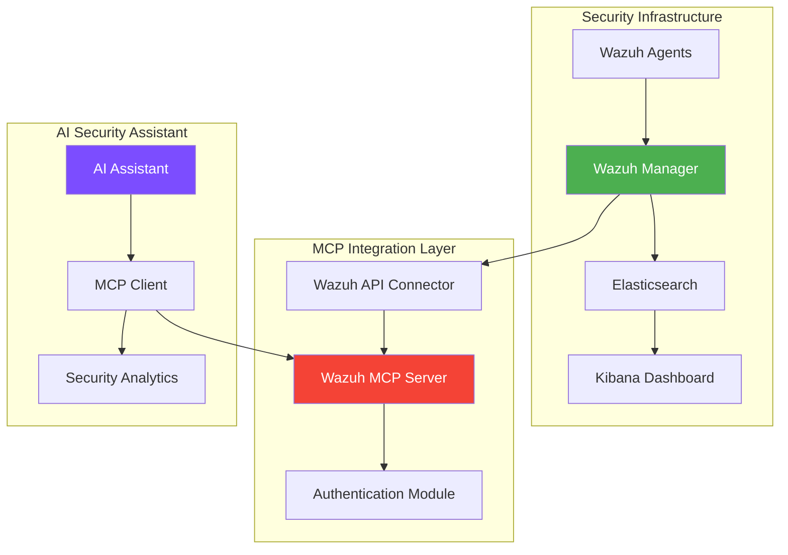

# Security Monitoring with Wazuh MCP Server

Learn how to integrate AI-powered security monitoring using the Wazuh MCP Server for intelligent threat detection and incident response.

## What You'll Build

An intelligent security monitoring system that enables AI assistants to:
- Query Wazuh SIEM data for threat analysis
- Perform automated incident response
- Generate security reports and dashboards
- Correlate security events across multiple sources

## Prerequisites

- Wazuh SIEM platform (version 4.0+)
- Python 3.8+ with MCP SDK
- Basic knowledge of security operations
- Understanding of SIEM concepts

## Architecture Overview



## Installation & Setup

### 1. Clone the Wazuh MCP Server

```bash
# Clone the repository
git clone https://github.com/gensecaihq/Wazuh-MCP-Server.git
cd Wazuh-MCP-Server

# Create virtual environment
python -m venv venv
source venv/bin/activate  # On Windows: venv\Scripts\activate

# Install dependencies
pip install -r requirements.txt
```

### 2. Configure Wazuh Connection

Create a configuration file `config.yaml`:

```yaml
wazuh:
  host: "wazuh-manager.example.com"
  port: 55000
  username: "mcp-user"
  password: "secure-password"
  protocol: "https"
  verify_ssl: true
  
mcp:
  server_name: "wazuh-security-server"
  version: "1.0.0"
  
security:
  rate_limit: 100  # requests per minute
  timeout: 30      # seconds
  max_results: 1000
  
logging:
  level: "INFO"
  file: "/var/log/wazuh-mcp.log"
```

### 3. Set Up Wazuh User

Create a dedicated user for MCP integration:

```bash
# On Wazuh Manager
curl -k -X POST "https://localhost:55000/security/users" \
  -H "Authorization: Bearer $API_TOKEN" \
  -H "Content-Type: application/json" \
  -d '{
    "username": "mcp-user",
    "password": "secure-password",
    "roles": ["readonly", "agents_admin"]
  }'
```

## Available Tools

The Wazuh MCP Server exposes several security-focused tools:

### 1. Query Security Alerts

```python
# Query recent high-severity alerts
alerts = await client.call_tool("query_alerts", {
    "timeframe": "24h",
    "severity": "high",
    "rule_groups": ["authentication", "intrusion_detection"],
    "limit": 50
})
```

### 2. Agent Management

```python
# Get agent status and information
agents = await client.call_tool("get_agents", {
    "status": "active",
    "platform": "linux"
})

# Restart specific agent
result = await client.call_tool("restart_agent", {
    "agent_id": "001"
})
```

### 3. Rule Analysis

```python
# Search for specific rules
rules = await client.call_tool("search_rules", {
    "search": "SSH",
    "category": "authentication",
    "enabled": true
})
```

### 4. Security Metrics

```python
# Get security dashboard metrics
metrics = await client.call_tool("get_security_metrics", {
    "timeframe": "7d",
    "metrics": ["alert_count", "agent_status", "rule_effectiveness"]
})
```

## Example: AI Security Assistant

Here's a complete example of an AI security assistant using the Wazuh MCP Server:

```python
import asyncio
from mcp import ClientSession, StdioServerParameters
from mcp.client.stdio import stdio_client
import logging

class SecurityAssistant:
    def __init__(self):
        self.client = None
        
    async def connect(self):
        """Connect to Wazuh MCP Server"""
        server_params = StdioServerParameters(
            command="python",
            args=["wazuh_mcp_server.py", "--config", "config.yaml"]
        )
        
        self.stdio_client = stdio_client(server_params)
        self.read, self.write = await self.stdio_client.__aenter__()
        self.client = ClientSession(self.read, self.write)
        await self.client.initialize()
        
    async def analyze_threats(self, timeframe="24h"):
        """Analyze recent threats and provide insights"""
        # Get high-severity alerts
        alerts = await self.client.call_tool("query_alerts", {
            "timeframe": timeframe,
            "severity": ["high", "critical"],
            "limit": 100
        })
        
        # Get agent status
        agents = await self.client.call_tool("get_agents", {
            "status": "all"
        })
        
        # Analyze patterns
        analysis = self._analyze_security_patterns(
            alerts.content[0].text,
            agents.content[0].text
        )
        
        return analysis
    
    def _analyze_security_patterns(self, alerts_data, agents_data):
        """Analyze security patterns and generate insights"""
        import json
        
        alerts = json.loads(alerts_data)
        agents = json.loads(agents_data)
        
        # Count alerts by type
        alert_types = {}
        for alert in alerts.get('data', []):
            rule_group = alert.get('rule', {}).get('groups', ['unknown'])[0]
            alert_types[rule_group] = alert_types.get(rule_group, 0) + 1
        
        # Check agent health
        agent_status = {}
        for agent in agents.get('data', []):
            status = agent.get('status', 'unknown')
            agent_status[status] = agent_status.get(status, 0) + 1
        
        return {
            "summary": {
                "total_alerts": len(alerts.get('data', [])),
                "alert_types": alert_types,
                "agent_status": agent_status
            },
            "recommendations": self._generate_recommendations(alert_types, agent_status)
        }
    
    def _generate_recommendations(self, alert_types, agent_status):
        """Generate security recommendations based on analysis"""
        recommendations = []
        
        # Check for authentication issues
        if alert_types.get('authentication', 0) > 10:
            recommendations.append({
                "type": "high_priority",
                "title": "High Authentication Alert Volume",
                "description": "Consider implementing additional authentication controls",
                "action": "Review authentication logs and implement MFA"
            })
        
        # Check for agent connectivity
        disconnected = agent_status.get('disconnected', 0)
        if disconnected > 0:
            recommendations.append({
                "type": "medium_priority", 
                "title": f"{disconnected} Agents Disconnected",
                "description": "Some agents are not reporting data",
                "action": "Investigate network connectivity and agent health"
            })
        
        return recommendations

# Usage example
async def main():
    assistant = SecurityAssistant()
    await assistant.connect()
    
    # Analyze threats
    analysis = await assistant.analyze_threats("6h")
    
    print("Security Analysis Report:")
    print(f"Total Alerts: {analysis['summary']['total_alerts']}")
    print(f"Alert Types: {analysis['summary']['alert_types']}")
    print(f"Agent Status: {analysis['summary']['agent_status']}")
    
    print("\nRecommendations:")
    for rec in analysis['recommendations']:
        print(f"- [{rec['type']}] {rec['title']}: {rec['description']}")

if __name__ == "__main__":
    asyncio.run(main())
```

## Security Best Practices

### 1. Authentication & Authorization

```yaml
# Enhanced security configuration
security:
  authentication:
    method: "token"
    token_expiry: 3600  # 1 hour
    refresh_enabled: true
  
  authorization:
    rbac_enabled: true
    allowed_roles: ["security_analyst", "soc_operator"]
    denied_operations: ["agent_delete", "rule_delete"]
  
  audit:
    log_all_requests: true
    sensitive_data_masking: true
```

### 2. Rate Limiting & Monitoring

```python
# Implement rate limiting
class RateLimitedWazuhClient:
    def __init__(self, requests_per_minute=60):
        self.requests_per_minute = requests_per_minute
        self.request_times = []
    
    async def check_rate_limit(self):
        now = time.time()
        # Remove requests older than 1 minute
        self.request_times = [t for t in self.request_times if now - t < 60]
        
        if len(self.request_times) >= self.requests_per_minute:
            raise RateLimitError("Rate limit exceeded")
        
        self.request_times.append(now)
```

### 3. Data Sanitization

```python
def sanitize_query_params(params):
    """Sanitize query parameters to prevent injection"""
    import re
    
    sanitized = {}
    for key, value in params.items():
        if isinstance(value, str):
            # Remove potential injection patterns
            value = re.sub(r'[;&|`$]', '', value)
            # Limit length
            value = value[:1000]
        sanitized[key] = value
    
    return sanitized
```

## Advanced Use Cases

### 1. Automated Incident Response

```python
async def automated_incident_response(self, alert_id):
    """Automatically respond to security incidents"""
    
    # Get alert details
    alert = await self.client.call_tool("get_alert", {
        "alert_id": alert_id
    })
    
    alert_data = json.loads(alert.content[0].text)
    rule_level = alert_data.get('rule', {}).get('level', 0)
    
    # High-severity incident response
    if rule_level >= 12:
        # Isolate affected agent
        agent_id = alert_data.get('agent', {}).get('id')
        if agent_id:
            await self.client.call_tool("isolate_agent", {
                "agent_id": agent_id,
                "reason": f"High-severity alert: {alert_id}"
            })
        
        # Create incident ticket
        await self.create_incident_ticket(alert_data)
        
        # Notify security team
        await self.notify_security_team(alert_data)
```

### 2. Threat Intelligence Integration

```python
async def enrich_with_threat_intel(self, ip_address):
    """Enrich security alerts with threat intelligence"""
    
    # Query threat intelligence feeds
    threat_data = await self.client.call_tool("query_threat_intel", {
        "indicator": ip_address,
        "indicator_type": "ip",
        "sources": ["virustotal", "otx", "internal"]
    })
    
    return threat_data
```

### 3. Security Metrics Dashboard

```python
async def generate_security_dashboard(self):
    """Generate real-time security dashboard data"""
    
    metrics = await self.client.call_tool("get_security_metrics", {
        "timeframe": "24h",
        "metrics": [
            "alert_count_by_severity",
            "top_attack_types", 
            "agent_health_status",
            "rule_effectiveness",
            "geographic_threat_distribution"
        ]
    })
    
    return self._format_dashboard_data(metrics)
```

## Troubleshooting

### Common Issues

1. **Connection Errors**
   ```bash
   # Check Wazuh API connectivity
   curl -k https://wazuh-manager:55000/
   
   # Verify credentials
   curl -k -X POST "https://wazuh-manager:55000/security/user/authenticate" \
     -H "Content-Type: application/json" \
     -d '{"username": "mcp-user", "password": "password"}'
   ```

2. **Authentication Failures**
   ```python
   # Enable debug logging
   logging.basicConfig(level=logging.DEBUG)
   
   # Check token validity
   token_info = await client.call_tool("validate_token", {})
   ```

3. **Performance Issues**
   ```yaml
   # Optimize configuration
   wazuh:
     connection_pool_size: 10
     request_timeout: 30
     max_retries: 3
   ```

## Security Considerations

!!! warning "Security Notice"
    - Always use HTTPS for Wazuh API connections
    - Implement proper access controls and role-based permissions
    - Regularly rotate API credentials
    - Monitor MCP server logs for suspicious activity
    - Validate all input parameters to prevent injection attacks

## Next Steps

1. **Explore Advanced Features**
   - Custom rule development
   - Automated threat hunting
   - Integration with SOAR platforms

2. **Scale Your Deployment**
   - Multi-tenant configurations
   - Load balancing and high availability
   - Performance optimization

3. **Integration Examples**
   - [pfSense Network Security](/samples/network-security/)
   - [Security Analytics Dashboard](/samples/security-dashboard/)

## Resources

- **[Wazuh MCP Server Repository](https://github.com/gensecaihq/Wazuh-MCP-Server)**
- **[Wazuh Documentation](https://documentation.wazuh.com/)**
- **[MCP Security Best Practices](/spec/security-model/)**

<script type="application/ld+json">
{
  "@context": "https://schema.org",
  "@type": "HowTo",
  "name": "Security Monitoring with Wazuh MCP Server",
  "description": "Learn how to integrate AI-powered security monitoring using Wazuh SIEM and Model Context Protocol",
  "keywords": "Wazuh, MCP, security monitoring, SIEM integration, threat detection, incident response",
  "step": [
    {
      "@type": "HowToStep",
      "name": "Install Wazuh MCP Server",
      "text": "Clone repository and install dependencies"
    },
    {
      "@type": "HowToStep",
      "name": "Configure Wazuh connection",
      "text": "Set up authentication and connection parameters"
    },
    {
      "@type": "HowToStep",
      "name": "Implement security tools",
      "text": "Use MCP tools for threat analysis and incident response"
    }
  ]
}
</script>