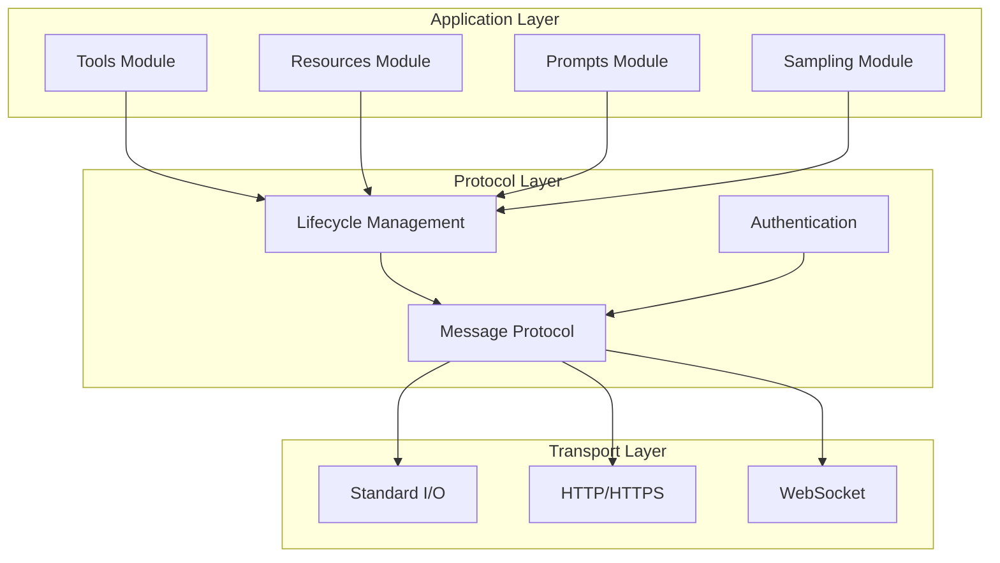
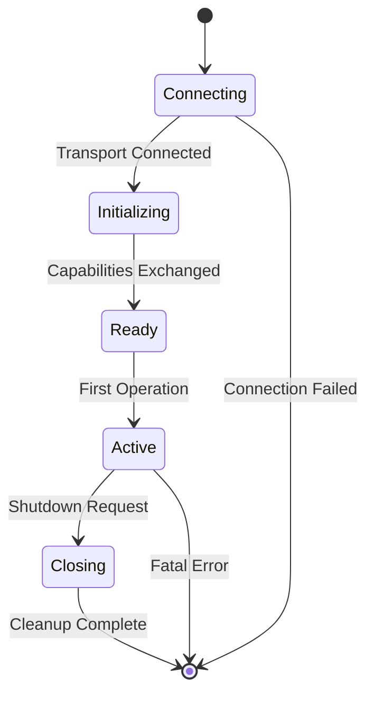
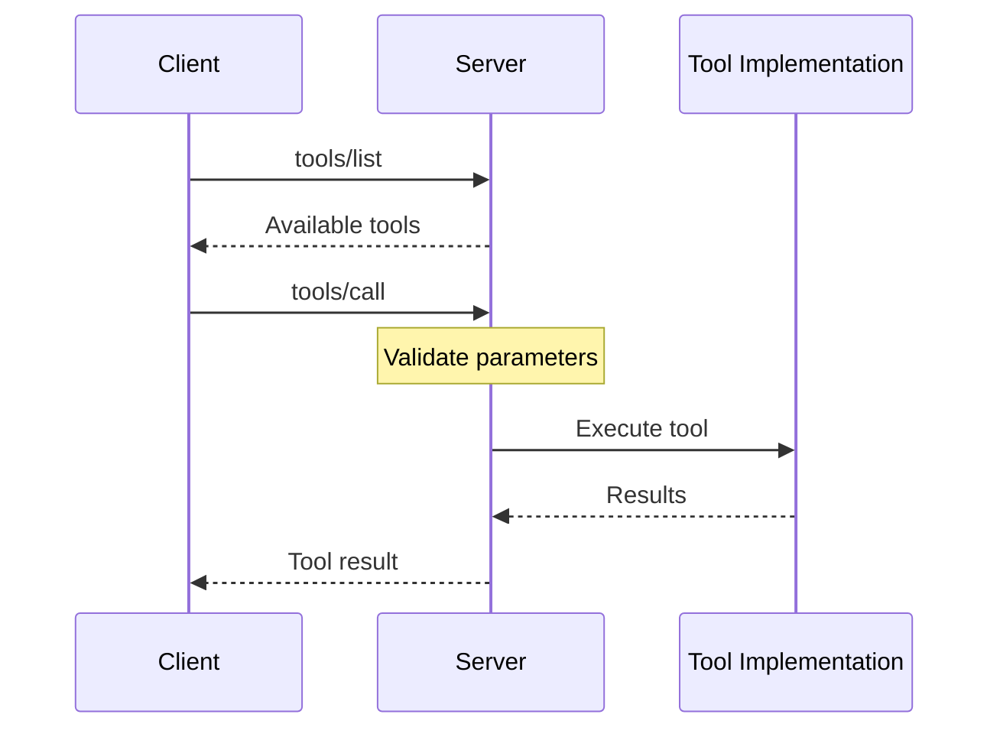
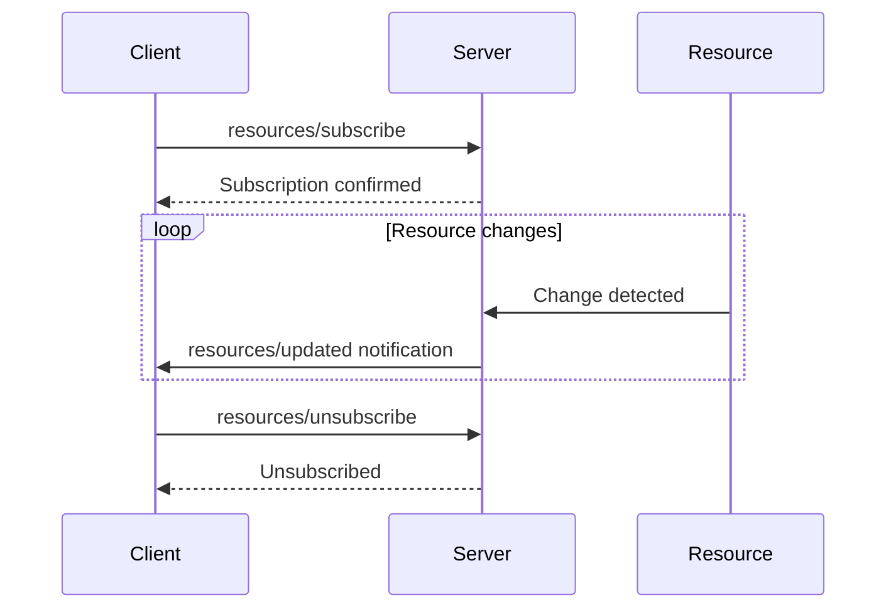

# Protocol Overview

## Architecture Philosophy

The Model Context Protocol is designed as a modular, layered system that separates concerns while maintaining simplicity. Each layer builds upon the previous, creating a robust yet flexible protocol.

## Protocol Layers



## Core Modules

### Base Protocol Module

The foundation that all other modules build upon:

- **JSON-RPC 2.0** message format
- **Request-Response** pattern
- **Error handling** standards
- **Batch operations** support

```typescript
interface BaseMessage {
  jsonrpc: "2.0";
  id?: string | number;
}

interface Request extends BaseMessage {
  method: string;
  params?: any;
}

interface Response extends BaseMessage {
  result?: any;
  error?: ErrorObject;
}
```

### Lifecycle Module

Manages connection state and capability negotiation:



**Key Methods:**
- `initialize` - Establish connection and exchange capabilities
- `initialized` - Confirm initialization complete
- `shutdown` - Graceful shutdown request
- `exit` - Force connection termination

### Authentication Module

Flexible authentication supporting multiple schemes:

```json
{
  "method": "initialize",
  "params": {
    "authentication": {
      "type": "bearer",
      "token": "eyJ0eXAiOiJKV1QiLCJhbGc..."
    }
  }
}
```

**Supported Types:**
- `bearer` - Token-based authentication
- `basic` - Username/password
- `oauth2` - OAuth 2.0 flows
- `custom` - Extension point

### Tools Module

Enables function execution:

```typescript
interface Tool {
  name: string;
  description: string;
  inputSchema: JSONSchema;
}

interface ToolResult {
  content: Content[];
  isError?: boolean;
}
```

**Methods:**
- `tools/list` - Discover available tools
- `tools/call` - Execute a tool
- `tools/list-changed` - Notification of tool changes

### Resources Module

Provides data access:

```typescript
interface Resource {
  uri: string;
  name: string;
  description?: string;
  mimeType?: string;
}

interface ResourceContent {
  uri: string;
  mimeType?: string;
  text?: string;
  blob?: string; // base64
}
```

**Methods:**
- `resources/list` - Discover resources
- `resources/read` - Access resource content
- `resources/subscribe` - Watch for changes
- `resources/unsubscribe` - Stop watching

### Prompts Module

Templates for guided interactions:

```typescript
interface Prompt {
  name: string;
  description?: string;
  arguments?: PromptArgument[];
}

interface PromptMessage {
  role: "user" | "assistant";
  content: Content;
}
```

**Methods:**
- `prompts/list` - Available prompts
- `prompts/get` - Retrieve prompt with arguments

### Sampling Module

Request AI model completions:

```typescript
interface SamplingRequest {
  messages: SamplingMessage[];
  modelPreferences?: ModelPreferences;
  systemPrompt?: string;
  includeContext?: "none" | "thisServer" | "allServers";
  temperature?: number;
  maxTokens?: number;
  stopSequences?: string[];
  metadata?: Record<string, any>;
}
```

**Methods:**
- `sampling/createMessage` - Request completion

## Message Flow Examples

### Tool Execution Flow



### Resource Subscription Flow



## Extension Points

MCP is designed for extensibility:

### Custom Methods

Servers can add custom methods using namespacing:

```json
{
  "method": "x-company/custom-operation",
  "params": {
    "customParam": "value"
  }
}
```

### Capability Extensions

Declare custom capabilities:

```json
{
  "capabilities": {
    "tools": true,
    "x-company": {
      "feature1": true,
      "version": "1.0"
    }
  }
}
```

## Protocol Versioning

MCP uses semantic versioning:

- **Major**: Breaking changes
- **Minor**: New features, backward compatible
- **Patch**: Bug fixes

Version negotiation ensures compatibility:

```json
{
  "method": "initialize",
  "params": {
    "protocolVersion": "1.0",
    "minimumVersion": "0.9"
  }
}
```

## Best Practices

### 1. Always Initialize First
Never send operational messages before successful initialization.

### 2. Handle Capabilities Properly
Check server capabilities before using features:

```python
if "tools" in server_capabilities:
    tools = await client.list_tools()
```

### 3. Implement Graceful Shutdown
Always attempt clean shutdown:

```python
try:
    await client.shutdown()
    await client.exit()
finally:
    transport.close()
```

### 4. Use Appropriate Transports
- **stdio**: Local tools, development
- **HTTP**: Stateless operations, REST-like
- **WebSocket**: Streaming, subscriptions

### 5. Follow Error Conventions
Use standard error codes and provide helpful error data.

## Implementation Checklist

For server implementers:

- [ ] JSON-RPC 2.0 compliance
- [ ] Initialize/shutdown lifecycle
- [ ] At least one feature module
- [ ] Capability declaration
- [ ] Error handling
- [ ] Schema validation
- [ ] Transport selection

For client implementers:

- [ ] Version negotiation
- [ ] Capability detection
- [ ] Graceful degradation
- [ ] Error recovery
- [ ] Transport abstraction
- [ ] Timeout handling

Ready to dive deeper? Continue to [Message Types →](/spec/message-types/)

<script type="application/ld+json">
{
  "@context": "https://schema.org",
  "@type": "TechArticle",
  "headline": "MCP Protocol Overview - Architecture and Modules",
  "description": "Comprehensive overview of the Model Context Protocol architecture, modules, and design principles",
  "author": {
    "@type": "Organization",
    "name": "How MCP Works"
  }
}
</script>