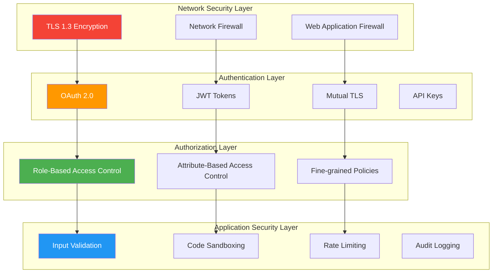

# MCP Security Model

Comprehensive security framework for protecting Model Context Protocol implementations against threats and ensuring data privacy.

## Security Architecture

The MCP security model implements defense-in-depth with multiple security layers:



## Transport Security

### TLS Configuration

All network transports must use TLS 1.3 or higher:

```yaml
# Server TLS Configuration
tls:
  version: "1.3"
  cipher_suites:
    - "TLS_AES_256_GCM_SHA384"
    - "TLS_AES_128_GCM_SHA256" 
    - "TLS_CHACHA20_POLY1305_SHA256"
  certificate: "/path/to/server.crt"
  private_key: "/path/to/server.key"
  ca_bundle: "/path/to/ca-bundle.crt"
```

### Mutual TLS (mTLS)

For high-security environments:

```python
# Client certificate authentication
import ssl

context = ssl.create_default_context(ssl.Purpose.SERVER_AUTH)
context.check_hostname = False
context.verify_mode = ssl.CERT_REQUIRED
context.load_cert_chain('/path/to/client.crt', '/path/to/client.key')
context.load_verify_locations('/path/to/ca.crt')

transport = HttpTransport(
    url="https://secure-mcp-server.com",
    ssl_context=context
)
```

### Certificate Management

```bash
# Generate CA certificate
openssl genrsa -out ca.key 4096
openssl req -new -x509 -days 365 -key ca.key -out ca.crt

# Generate server certificate
openssl genrsa -out server.key 4096
openssl req -new -key server.key -out server.csr
openssl x509 -req -days 365 -in server.csr -CA ca.crt -CAkey ca.key -out server.crt

# Generate client certificate
openssl genrsa -out client.key 4096
openssl req -new -key client.key -out client.csr
openssl x509 -req -days 365 -in client.csr -CA ca.crt -CAkey ca.key -out client.crt
```

## Authentication Methods

### OAuth 2.0 Integration

OAuth 2.0 support for enterprise identity providers:

```json
{
  "method": "initialize",
  "params": {
    "authentication": {
      "type": "oauth2",
      "provider": "https://auth.company.com",
      "client_id": "mcp-client-id",
      "scopes": ["mcp:read", "mcp:write", "mcp:admin"],
      "token": "eyJhbGciOiJSUzI1NiIsInR5cCI6IkpXVCJ9..."
    }
  }
}
```

### JWT Token Authentication

Stateless authentication with JWT tokens:

```python
import jwt
from datetime import datetime, timedelta

# Generate JWT token
payload = {
    'sub': 'user@company.com',
    'iat': datetime.utcnow(),
    'exp': datetime.utcnow() + timedelta(hours=1),
    'scopes': ['mcp:tools', 'mcp:resources']
}

token = jwt.encode(payload, 'secret-key', algorithm='HS256')

# Use in MCP request
headers = {
    'Authorization': f'Bearer {token}'
}
```

### API Key Authentication

Simple API key-based authentication:

```json
{
  "method": "initialize", 
  "params": {
    "authentication": {
      "type": "api_key",
      "key": "mcp_ak_1234567890abcdef",
      "location": "header",
      "name": "X-API-Key"
    }
  }
}
```

### Custom Authentication

Extensible authentication framework:

```python
class CustomAuthenticator:
    async def authenticate(self, request):
        # Custom authentication logic
        token = request.headers.get('X-Custom-Auth')
        if not self.validate_token(token):
            raise AuthenticationError("Invalid token")
        
        return UserContext(
            user_id=self.extract_user_id(token),
            permissions=self.get_permissions(token)
        )
```

## Authorization Framework

### Role-Based Access Control (RBAC)

Define roles and permissions:

```yaml
# roles.yaml
roles:
  admin:
    permissions:
      - "tools:*"
      - "resources:*"
      - "prompts:*"
      - "system:manage"
  
  developer:
    permissions:
      - "tools:list"
      - "tools:call"
      - "resources:read"
      - "prompts:get"
  
  readonly:
    permissions:
      - "tools:list"
      - "resources:list"
      - "prompts:list"
```

### Attribute-Based Access Control (ABAC)

Fine-grained policy-based authorization:

```python
# ABAC Policy Example
class ABACPolicy:
    def evaluate(self, subject, resource, action, environment):
        # Time-based access
        if environment.time.hour < 9 or environment.time.hour > 17:
            if action in ['tools:call', 'resources:write']:
                return False
        
        # Resource-specific rules
        if resource.type == 'database' and resource.name == 'production':
            return subject.role in ['admin', 'senior-developer']
        
        # IP-based restrictions
        if subject.ip_address not in environment.allowed_ips:
            return False
        
        return True
```

### Permission Matrix

| Role | Tools List | Tools Call | Resources Read | Resources Write | Admin |
|------|------------|------------|----------------|-----------------|-------|
| **Guest** | ✅ | ❌ | ❌ | ❌ | ❌ |
| **User** | ✅ | ✅ | ✅ | ❌ | ❌ |
| **Developer** | ✅ | ✅ | ✅ | ✅ | ❌ |
| **Admin** | ✅ | ✅ | ✅ | ✅ | ✅ |

## Input Validation & Sanitization

### Schema-Based Validation

All tool parameters must validate against JSON Schema:

```json
{
  "inputSchema": {
    "type": "object",
    "properties": {
      "query": {
        "type": "string",
        "pattern": "^SELECT.*",
        "maxLength": 1000,
        "description": "SQL SELECT query only"
      },
      "limit": {
        "type": "integer",
        "minimum": 1,
        "maximum": 1000,
        "default": 100
      }
    },
    "required": ["query"],
    "additionalProperties": false
  }
}
```

### SQL Injection Prevention

Use parameterized queries:

```python
# Secure implementation
@server.tool()
async def query_database(query: str, parameters: list = None):
    # Validate query pattern
    if not re.match(r'^SELECT\s+', query, re.IGNORECASE):
        raise ValueError("Only SELECT queries allowed")
    
    # Use parameterized query
    async with database.connection() as conn:
        result = await conn.execute(query, parameters or [])
        return result.fetchall()

# Insecure - DON'T DO THIS
# await conn.execute(f"SELECT * FROM users WHERE id = {user_id}")
```

### Path Traversal Prevention

Validate file paths:

```python
import os
from pathlib import Path

@server.tool()
async def read_file(file_path: str):
    # Validate path is within allowed directory
    allowed_path = Path("/var/data")
    requested_path = Path(file_path).resolve()
    
    if not requested_path.is_relative_to(allowed_path):
        raise SecurityError("Path traversal attempt detected")
    
    # Additional filename validation
    if '..' in file_path or file_path.startswith('/'):
        raise SecurityError("Invalid file path")
    
    return await read_file_content(requested_path)
```

## Rate Limiting & DoS Protection

### Token Bucket Algorithm

```python
import asyncio
from collections import defaultdict
from time import time

class RateLimiter:
    def __init__(self, max_requests=100, window_seconds=3600):
        self.max_requests = max_requests
        self.window_seconds = window_seconds
        self.buckets = defaultdict(list)
    
    async def check_rate_limit(self, client_id: str):
        now = time()
        bucket = self.buckets[client_id]
        
        # Remove expired entries
        bucket[:] = [t for t in bucket if now - t < self.window_seconds]
        
        if len(bucket) >= self.max_requests:
            raise RateLimitError("Rate limit exceeded")
        
        bucket.append(now)
```

### Sliding Window Rate Limiting

```python
class SlidingWindowRateLimit:
    def __init__(self, max_requests=1000, window_minutes=60):
        self.max_requests = max_requests
        self.window_seconds = window_minutes * 60
        self.request_log = defaultdict(list)
    
    def is_allowed(self, client_id: str) -> bool:
        now = time()
        requests = self.request_log[client_id]
        
        # Clean old requests
        cutoff = now - self.window_seconds
        self.request_log[client_id] = [t for t in requests if t > cutoff]
        
        if len(self.request_log[client_id]) >= self.max_requests:
            return False
        
        self.request_log[client_id].append(now)
        return True
```

## Audit Logging

### Comprehensive Audit Trail

```python
import logging
import json
from datetime import datetime

class AuditLogger:
    def __init__(self):
        self.logger = logging.getLogger('mcp.audit')
        handler = logging.FileHandler('/var/log/mcp/audit.log')
        formatter = logging.Formatter('%(asctime)s %(message)s')
        handler.setFormatter(formatter)
        self.logger.addHandler(handler)
        self.logger.setLevel(logging.INFO)
    
    def log_request(self, client_id, method, params, client_ip):
        audit_entry = {
            'timestamp': datetime.utcnow().isoformat(),
            'event_type': 'mcp_request',
            'client_id': client_id,
            'client_ip': client_ip,
            'method': method,
            'params': self.sanitize_params(params),
            'request_id': generate_request_id()
        }
        self.logger.info(json.dumps(audit_entry))
    
    def log_tool_execution(self, tool_name, client_id, success, duration):
        audit_entry = {
            'timestamp': datetime.utcnow().isoformat(),
            'event_type': 'tool_execution',
            'tool_name': tool_name,
            'client_id': client_id,
            'success': success,
            'duration_ms': duration,
            'request_id': get_current_request_id()
        }
        self.logger.info(json.dumps(audit_entry))
```

### SIEM Integration

Send audit logs to Security Information and Event Management systems:

```python
import syslog

class SIEMIntegration:
    def __init__(self, siem_host, siem_port):
        syslog.openlog("mcp-server")
        
    def send_security_event(self, event_type, severity, details):
        message = {
            'event_type': event_type,
            'severity': severity,
            'timestamp': datetime.utcnow().isoformat(),
            'details': details
        }
        
        syslog.syslog(syslog.LOG_WARNING, json.dumps(message))
```

## Data Protection

### Encryption at Rest

Encrypt sensitive data:

```python
from cryptography.fernet import Fernet

class DataEncryption:
    def __init__(self, key: bytes):
        self.cipher = Fernet(key)
    
    def encrypt_sensitive_data(self, data: str) -> str:
        return self.cipher.encrypt(data.encode()).decode()
    
    def decrypt_sensitive_data(self, encrypted_data: str) -> str:
        return self.cipher.decrypt(encrypted_data.encode()).decode()

# Usage
encryption = DataEncryption(Fernet.generate_key())
encrypted_token = encryption.encrypt_sensitive_data("api-token-value")
```

### Data Anonymization

Remove or mask PII:

```python
import re

class DataAnonymizer:
    @staticmethod
    def mask_email(email: str) -> str:
        local, domain = email.split('@')
        return f"{local[0]}***@{domain}"
    
    @staticmethod
    def mask_credit_card(cc_number: str) -> str:
        return f"****-****-****-{cc_number[-4:]}"
    
    @staticmethod
    def remove_pii(text: str) -> str:
        # Remove Social Security Numbers
        text = re.sub(r'\b\d{3}-\d{2}-\d{4}\b', '[SSN]', text)
        
        # Remove phone numbers
        text = re.sub(r'\b\d{3}-\d{3}-\d{4}\b', '[PHONE]', text)
        
        return text
```

## Threat Modeling

### STRIDE Analysis

| Threat | Risk Level | Mitigation |
|--------|------------|------------|
| **Spoofing** | High | Strong authentication, mTLS |
| **Tampering** | Medium | TLS encryption, message signing |
| **Repudiation** | Low | Comprehensive audit logging |
| **Information Disclosure** | High | Encryption, access controls |
| **Denial of Service** | Medium | Rate limiting, input validation |
| **Elevation of Privilege** | High | RBAC, least privilege principle |

### Common Attack Vectors

1. **Man-in-the-Middle Attacks**
   - Mitigation: TLS 1.3, certificate pinning
   
2. **Injection Attacks**
   - Mitigation: Input validation, parameterized queries
   
3. **Authentication Bypass**
   - Mitigation: Multi-factor authentication, token validation
   
4. **Privilege Escalation**
   - Mitigation: Principle of least privilege, regular audits

5. **MCP Protocol Poisoning**
   - **Description**: Malicious manipulation of MCP message content to bypass security controls
   - **Attack Vector**: Injecting malicious payloads in tool parameters or resource content
   - **Example**: [MCP Poisoning PoC](https://github.com/gensecaihq/mcp-poisoning-poc) demonstrates potential vulnerabilities
   - **Mitigation**: 
     - Strict input validation with allowlists
     - Content sanitization and encoding
     - Sandboxed execution environments
     - Regular security audits and penetration testing

## Security Configuration Checklist

### Server Security

- [ ] **TLS 1.3** enabled for all network transports
- [ ] **Strong authentication** implemented (OAuth 2.0, mTLS)
- [ ] **Authorization policies** defined and enforced
- [ ] **Input validation** for all tool parameters
- [ ] **Rate limiting** configured appropriately
- [ ] **Audit logging** enabled and monitored
- [ ] **Error handling** doesn't leak sensitive information
- [ ] **Security headers** properly configured

### Client Security

- [ ] **Certificate validation** enabled
- [ ] **Token storage** secured (encrypted, limited lifetime)
- [ ] **Network timeouts** configured
- [ ] **Error handling** doesn't expose credentials
- [ ] **Least privilege** principle followed
- [ ] **Secure credential management** implemented

### Operational Security

- [ ] **Regular security audits** scheduled
- [ ] **Vulnerability scanning** automated
- [ ] **Incident response plan** documented
- [ ] **Security monitoring** alerts configured
- [ ] **Backup and recovery** procedures tested
- [ ] **Security training** for development team

## Compliance Frameworks

### SOC 2 Type II

Security controls for service organizations:

- **Security**: Access controls, encryption
- **Availability**: Monitoring, redundancy
- **Processing Integrity**: Input validation, error handling
- **Confidentiality**: Data classification, encryption
- **Privacy**: Data minimization, consent management

### ISO 27001

Information security management system:

- **Risk Assessment**: Regular threat analysis
- **Security Policies**: Documented procedures
- **Access Control**: Identity and access management
- **Cryptography**: Encryption standards
- **Security Monitoring**: Continuous monitoring

### Industry-Specific Compliance

- **Healthcare (HIPAA)**: Patient data protection, audit trails
- **Finance (PCI DSS)**: Payment card data security
- **Government (FedRAMP)**: Federal security controls
- **EU (GDPR)**: Personal data protection, consent

## Security Best Practices

1. **Defense in Depth** - Multiple security layers
2. **Principle of Least Privilege** - Minimal necessary permissions
3. **Zero Trust Architecture** - Never trust, always verify
4. **Security by Design** - Built-in from the start
5. **Continuous Monitoring** - Real-time threat detection
6. **Regular Updates** - Keep dependencies current
7. **Security Training** - Educate development teams
8. **Incident Response** - Prepare for security events

Ready to secure your implementation? Check our [Security Hardening Guide →](/impl/security-hardening/)

<script type="application/ld+json">
{
  "@context": "https://schema.org",
  "@type": "TechArticle",
  "headline": "MCP Security Model - Comprehensive Security Framework",
  "description": "Complete security model for Model Context Protocol implementations including authentication, authorization, encryption, and threat protection",
  "keywords": "MCP security, model context protocol security, authentication, authorization, encryption, cybersecurity, API security",
  "author": {
    "@type": "Organization",
    "name": "How MCP Works"
  },
  "datePublished": "2024-06-24",
  "dateModified": "2024-06-24"
}
</script>