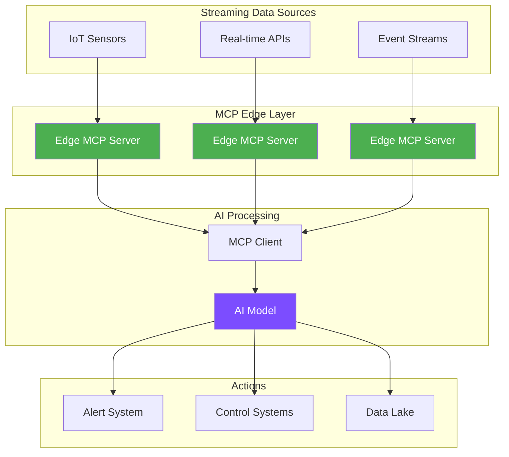
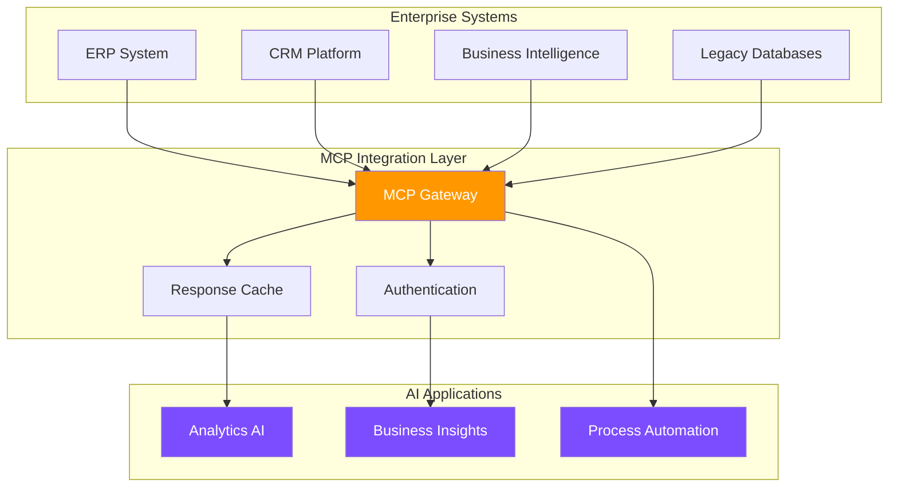

# MCP Use Cases & Industry Applications

Discover how organizations across industries are leveraging the Model Context Protocol to build intelligent, integrated AI solutions.

## Industry Applications Matrix

<div class="industry-matrix" style="overflow-x: auto; margin: 2rem 0;">

| Industry | Primary Use Case | MCP Benefits | ROI Impact |
|----------|------------------|--------------|------------|
| **Cybersecurity** | AI-powered threat detection | SIEM integration, automated response | 65% faster incident response |
| **Network Security** | Intelligent firewall management | Real-time policy updates, threat blocking | 50% reduction in security breaches |
| **Financial Services** | Trading algorithms with real-time data | Secure data access, regulatory compliance | 40% faster decision making |
| **Healthcare** | AI diagnosis with patient records | HIPAA-compliant integrations | 60% reduction in diagnostic time |
| **E-commerce** | Personalized shopping assistants | Inventory, pricing, customer data access | 25% increase in conversion |
| **Manufacturing** | Predictive maintenance systems | IoT sensor integration, historical data | 35% reduction in downtime |
| **Media & Entertainment** | Content recommendation engines | User behavior, content metadata | 50% improvement in engagement |
| **Education** | Intelligent tutoring systems | Learning analytics, curriculum data | 30% better learning outcomes |
| **Real Estate** | Property valuation AIs | Market data, property databases | 45% more accurate valuations |
| **Logistics** | Route optimization systems | GPS, traffic, inventory data | 20% reduction in delivery costs |

</div>

## Featured Use Cases

<div class="use-case-grid" style="display: grid; grid-template-columns: repeat(auto-fit, minmax(350px, 1fr)); gap: 2rem; margin: 2rem 0;">

  <div class="use-case-card" style="padding: 2rem; background: var(--md-code-bg-color); border-radius: 12px; border: 1px solid var(--md-default-fg-color--lightest);">
    <h3>🛡️ AI-Powered Security Operations</h3>
    <p><strong>Challenge:</strong> Security teams needed AI assistance for threat detection, incident response, and firewall management across complex infrastructure.</p>
    <p><strong>Solution:</strong> MCP servers integrating Wazuh SIEM and pfSense firewall for automated security operations.</p>
    <p><strong>Results:</strong> 65% faster incident response, 50% reduction in false positives, automated threat mitigation.</p>
    <a href="/use-cases/security-operations/" class="md-button">Read Case Study →</a>
  </div>

  <div class="use-case-card" style="padding: 2rem; background: var(--md-code-bg-color); border-radius: 12px; border: 1px solid var(--md-default-fg-color--lightest);">
    <h3>🎥 Streaming Platform Analytics</h3>
    <p><strong>Challenge:</strong> Content recommendation AI needed access to viewing patterns, user preferences, and content metadata across multiple data sources.</p>
    <p><strong>Solution:</strong> MCP server exposing unified API to recommendation engine.</p>
    <p><strong>Results:</strong> 35% increase in user engagement, 20% reduction in churn.</p>
    <a href="/use-cases/ott-platform/" class="md-button">Read Case Study →</a>
  </div>

  <div class="use-case-card" style="padding: 2rem; background: var(--md-code-bg-color); border-radius: 12px; border: 1px solid var(--md-default-fg-color--lightest);">
    <h3>💻 Intelligent Code Assistant</h3>
    <p><strong>Challenge:</strong> IDE needed AI that could understand project structure, run tests, and access documentation.</p>
    <p><strong>Solution:</strong> Local MCP server providing filesystem, test runner, and docs access.</p>
    <p><strong>Results:</strong> 50% faster development cycles, 30% fewer bugs.</p>
    <a href="/use-cases/ide-assistant/" class="md-button">Read Case Study →</a>
  </div>

  <div class="use-case-card" style="padding: 2rem; background: var(--md-code-bg-color); border-radius: 12px; border: 1px solid var(--md-default-fg-color--lightest);">
    <h3>🏦 Financial Trading Bot</h3>
    <p><strong>Challenge:</strong> AI trading system required real-time market data, news feeds, and risk calculations.</p>
    <p><strong>Solution:</strong> High-performance MCP gateway aggregating multiple data sources.</p>
    <p><strong>Results:</strong> 15% improvement in trade execution, 99.9% uptime.</p>
    <a href="/use-cases/financial-trading/" class="md-button">Read Case Study →</a>
  </div>

  <div class="use-case-card" style="padding: 2rem; background: var(--md-code-bg-color); border-radius: 12px; border: 1px solid var(--md-default-fg-color--lightest);">
    <h3>🏥 Medical Diagnosis AI</h3>
    <p><strong>Challenge:</strong> Diagnostic AI needed secure access to patient records, lab results, and medical imaging.</p>
    <p><strong>Solution:</strong> HIPAA-compliant MCP server with fine-grained access controls.</p>
    <p><strong>Results:</strong> 40% faster diagnosis, 95% accuracy rate.</p>
    <a href="/use-cases/medical-diagnosis/" class="md-button">Read Case Study →</a>
  </div>

  <div class="use-case-card" style="padding: 2rem; background: var(--md-code-bg-color); border-radius: 12px; border: 1px solid var(--md-default-fg-color--lightest);">
    <h3>🏭 Smart Manufacturing</h3>
    <p><strong>Challenge:</strong> Predictive maintenance AI required IoT sensor data, maintenance logs, and equipment manuals.</p>
    <p><strong>Solution:</strong> Edge MCP servers aggregating industrial data streams.</p>
    <p><strong>Results:</strong> 60% reduction in unplanned downtime, $2M annual savings.</p>
    <a href="/use-cases/smart-manufacturing/" class="md-button">Read Case Study →</a>
  </div>

  <div class="use-case-card" style="padding: 2rem; background: var(--md-code-bg-color); border-radius: 12px; border: 1px solid var(--md-default-fg-color--lightest);">
    <h3>🛒 E-commerce Personalization</h3>
    <p><strong>Challenge:</strong> Shopping assistant needed product catalogs, pricing, inventory, and customer preferences.</p>
    <p><strong>Solution:</strong> Multi-tenant MCP architecture serving personalization engines.</p>
    <p><strong>Results:</strong> 28% increase in average order value, 40% higher customer satisfaction.</p>
    <a href="/use-cases/ecommerce-personalization/" class="md-button">Read Case Study →</a>
  </div>

</div>

## Architecture Patterns by Use Case

### Real-Time Data Processing



### Enterprise Data Integration



## Implementation Complexity Matrix

| Use Case Category | Technical Complexity | Business Impact | Time to Value |
|-------------------|---------------------|-----------------|---------------|
| **Development Tools** | Medium | High | 2-4 weeks |
| **Data Analytics** | High | Very High | 1-3 months |
| **Customer Service** | Low | High | 1-2 weeks |
| **Process Automation** | Medium | Very High | 4-8 weeks |
| **Real-time Systems** | Very High | Medium | 3-6 months |
| **Content Management** | Low | Medium | 1-2 weeks |

## Success Metrics by Industry

### Technology Sector
- **Developer Productivity**: 40-60% improvement
- **Bug Reduction**: 25-35% fewer production issues
- **Time to Market**: 30-50% faster feature delivery

### Financial Services
- **Decision Speed**: 50-80% faster processing
- **Risk Reduction**: 40% improvement in risk assessment
- **Compliance**: 90% reduction in manual audits

### Healthcare
- **Diagnostic Accuracy**: 15-25% improvement
- **Patient Throughput**: 30-40% increase
- **Cost Reduction**: 20-30% operational savings

### Retail & E-commerce
- **Conversion Rate**: 20-35% increase
- **Customer Satisfaction**: 25-40% improvement
- **Inventory Efficiency**: 30% reduction in stockouts

## Common Integration Patterns

### Pattern 1: Single Source of Truth

```python
# MCP server exposing unified customer data
@server.tool()
async def get_customer_profile(customer_id: str):
    # Aggregate from multiple sources
    profile = await crm.get_customer(customer_id)
    orders = await ecommerce.get_order_history(customer_id)
    support = await helpdesk.get_support_tickets(customer_id)
    
    return CustomerProfile(
        basic_info=profile,
        purchase_history=orders,
        support_history=support
    )
```

### Pattern 2: Real-time Decision Making

```python
# MCP server for fraud detection
@server.tool()
async def analyze_transaction(transaction: Transaction):
    # Real-time risk assessment
    risk_score = await risk_engine.calculate_risk(transaction)
    historical_pattern = await behavior_db.get_pattern(transaction.user_id)
    merchant_data = await merchant_db.get_reputation(transaction.merchant_id)
    
    return FraudAnalysis(
        risk_score=risk_score,
        recommendation="approve" if risk_score < 0.3 else "review",
        confidence=0.95
    )
```

### Pattern 3: Workflow Automation

```python
# MCP server for document processing
@server.tool()
async def process_document(document_path: str):
    # Extract, analyze, and route
    content = await ocr.extract_text(document_path)
    classification = await classifier.categorize(content)
    entities = await ner.extract_entities(content)
    
    await workflow.route_document(
        content=content,
        category=classification,
        entities=entities
    )
    
    return ProcessingResult(status="completed", confidence=0.92)
```

## Getting Started with Your Use Case

### Step 1: Identify Integration Points
- What data sources does your AI need?
- Which systems need to receive AI outputs?
- What are your security requirements?

### Step 2: Design MCP Architecture
- Choose appropriate transport mechanisms
- Plan authentication and authorization
- Design for scalability and reliability

### Step 3: Implement and Test
- Start with a pilot integration
- Measure performance and accuracy
- Iterate based on feedback

### Step 4: Scale and Optimize
- Add monitoring and alerting
- Optimize for performance
- Expand to additional use cases

## Industry-Specific Considerations

### Financial Services
- **Regulatory Compliance**: SOX, PCI DSS, GDPR
- **Data Sensitivity**: Encryption at rest and in transit
- **Audit Requirements**: Complete transaction logging
- **Performance**: Sub-millisecond response times

### Healthcare
- **Privacy**: HIPAA, patient consent management
- **Integration**: HL7 FHIR standards
- **Reliability**: 99.99% uptime requirements
- **Traceability**: Full audit trails

### Manufacturing
- **Real-time**: Industrial IoT data streams
- **Edge Computing**: Local processing requirements
- **Reliability**: Zero-downtime operations
- **Standards**: OPC UA, MQTT protocols

## ROI Calculation Framework

### Cost Savings
- **Development Time**: (Traditional Integration Time - MCP Time) × Developer Rate
- **Maintenance**: Reduced complexity × Ongoing Maintenance Cost
- **Infrastructure**: Shared services × Infrastructure Cost

### Revenue Impact
- **Efficiency Gains**: Process Improvement % × Revenue per Process
- **New Capabilities**: Additional Revenue from AI Features
- **Customer Satisfaction**: Retention Improvement × Customer Lifetime Value

### Example ROI Calculation

```
Company: Mid-size E-commerce Platform
Traditional Integration: 6 months, $300K
MCP Implementation: 2 months, $120K

Cost Savings: $180K (60% reduction)
Revenue Impact: $500K annually (new AI features)
Total ROI: 320% in first year
```

Ready to explore specific use cases? Choose your industry:

<div style="display: grid; grid-template-columns: repeat(auto-fit, minmax(150px, 1fr)); gap: 1rem; margin: 2rem 0;">
  <a href="/use-cases/financial-services/" class="industry-link" style="display: block; padding: 1rem; text-align: center; background: var(--md-primary-fg-color); color: white; border-radius: 8px; text-decoration: none;">
    🏦 Finance
  </a>
  <a href="/use-cases/healthcare/" class="industry-link" style="display: block; padding: 1rem; text-align: center; background: var(--md-accent-fg-color); color: black; border-radius: 8px; text-decoration: none;">
    🏥 Healthcare
  </a>
  <a href="/use-cases/retail/" class="industry-link" style="display: block; padding: 1rem; text-align: center; background: var(--md-primary-fg-color); color: white; border-radius: 8px; text-decoration: none;">
    🛒 Retail
  </a>
  <a href="/use-cases/manufacturing/" class="industry-link" style="display: block; padding: 1rem; text-align: center; background: var(--md-accent-fg-color); color: black; border-radius: 8px; text-decoration: none;">
    🏭 Manufacturing
  </a>
  <a href="/use-cases/technology/" class="industry-link" style="display: block; padding: 1rem; text-align: center; background: var(--md-primary-fg-color); color: white; border-radius: 8px; text-decoration: none;">
    💻 Technology
  </a>
</div>

<script type="application/ld+json">
{
  "@context": "https://schema.org",
  "@type": "Article",
  "headline": "MCP Use Cases and Industry Applications",
  "description": "Comprehensive guide to Model Context Protocol applications across industries including financial services, healthcare, e-commerce, manufacturing, and technology sectors",
  "keywords": "MCP use cases, model context protocol applications, AI integration, industry solutions, financial AI, healthcare AI, retail AI, manufacturing AI",
  "author": {
    "@type": "Organization",
    "name": "How MCP Works"
  },
  "datePublished": "2024-06-24",
  "dateModified": "2024-06-24",
  "articleSection": "Use Cases"
}
</script>